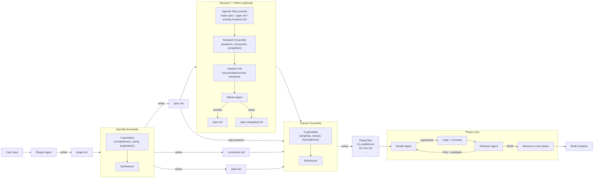
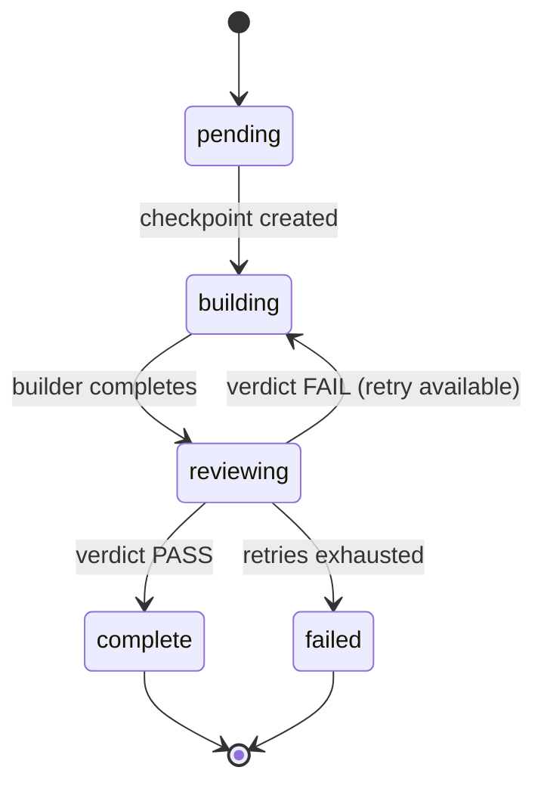
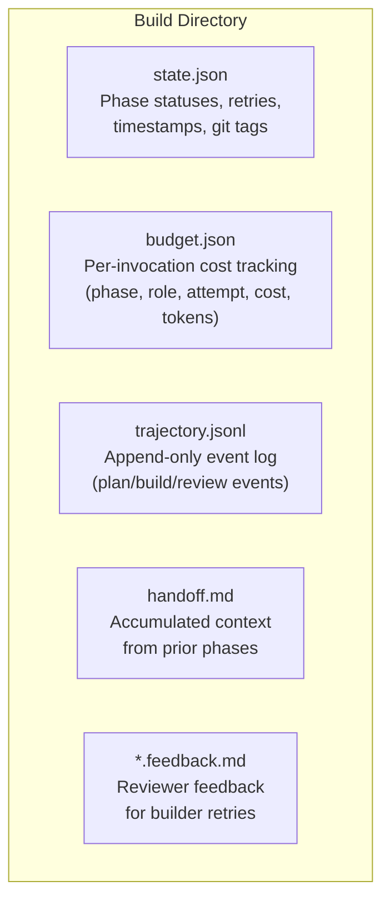
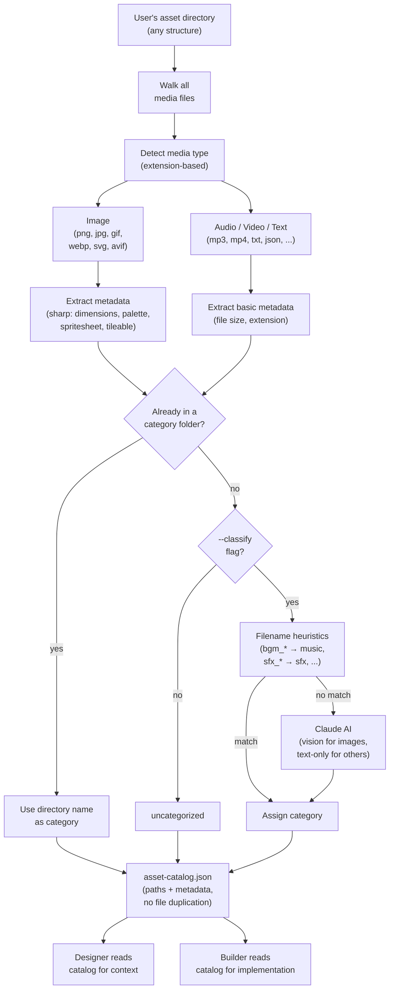

# Architecture

Ridgeline is a build harness for long-horizon software execution. It
decomposes large software projects into phased builds using a multi-agent
system -- shaper, specifier, researcher (optional), refiner (optional),
planner, builder, reviewer -- driven by the Claude CLI.[^1] The harness manages
state through git checkpoints, tracks costs, and supports resumable execution
when things go wrong.

Ridgeline itself is lightweight: a single runtime dependency (commander for
CLI parsing) and the Claude CLI installed on the host. Everything else --
planning, implementation, verification -- is delegated to Claude agents with
scoped tool permissions.

## Pipeline Flow



Each phase gets a fresh Claude context window. The builder receives the phase
spec, constraints, taste, and an accumulated handoff file carrying context from
prior phases. The reviewer inspects the builder's git diff against acceptance
criteria and produces a structured verdict.

## Agent Roles and Permissions

Each agent has a focused role and scoped tool access enforced by the Claude CLI.

| Agent | Role | Tools | Notes |
|-------|------|-------|-------|
| **Shaper** | Gathers project context through Q&A and codebase analysis | Read, Glob, Grep | Only active during `ridgeline shape` |
| **Specifier** | Synthesizes spec from shape + specialist proposals | Read, Write, Glob, Grep | Ensemble: 3 specialists + synthesizer |
| **Researcher** | Investigates spec using web sources | WebFetch, WebSearch, Bash (specialists); Write (synthesizer) | Optional; ensemble: 3 specialists + synthesizer (deep) or 1 + synthesizer (quick) |
| **Refiner** | Merges research findings into spec.md | Read, Write | Optional; single agent; writes both spec.md and spec.changelog.md |
| **Planner** | Synthesizes phase plan from spec + specialist proposals | Write | Ensemble: 3 specialists + synthesizer |
| **Builder** | Implements a single phase spec | Read, Write, Edit, Bash, Glob, Grep, Agent | Full access; sandbox optional |
| **Reviewer** | Verifies phase output against acceptance criteria | Read, Bash, Glob, Grep, Agent | Read-only to project files; produces JSON verdict |

The permission boundaries are enforced at invocation time via Claude CLI's
`--allowedTools` flag, not just by prompt instruction.[^3]

## Phase Lifecycle



For each phase:

1. **Checkpoint.** The harness commits any dirty working tree and creates a git
   tag (`ridgeline/checkpoint/<build>/<phase>`). This is the rollback point.

2. **Build.** The builder agent receives the phase spec, constraints, taste,
   accumulated handoff, and (on retry) the reviewer's feedback. It implements
   the phase, runs the check command, commits incrementally, and appends to
   handoff.md.

3. **Review.** The reviewer agent receives the phase spec, the git diff from
   checkpoint to HEAD, and constraints. It walks each acceptance criterion,
   runs verification commands, and produces a structured JSON verdict.

4. **Verdict.**
   - **PASS**: the harness creates a completion tag
     (`ridgeline/phase/<build>/<phase>`), updates state.json, and advances to
     the next phase.
   - **FAIL**: the harness generates a feedback file from the verdict and
     retries the builder (up to `--max-retries`, default 2).
   - **Retries exhausted**: the phase is marked failed and the build halts with
     recovery instructions.

## Specialist Sub-agents

Builders and reviewers can delegate to specialist sub-agents for focused tasks.
Specialists are discovered at runtime by scanning agent directories for
markdown files with valid frontmatter.

| Specialist | Model | Purpose |
|------------|-------|---------|
| **verifier** | sonnet | Runs check commands, lint, type-check, tests. Can auto-fix mechanical issues. |
| **explorer** | sonnet | Read-only codebase exploration. Returns structured briefings on targeted areas. |
| **tester** | sonnet | Writes acceptance-level tests from criteria. |
| **auditor** | sonnet | Checks module graph integrity -- circular deps, unresolved imports. Read-only. |

Specialists use sonnet by default for cost efficiency. They run in their own
context window, keeping the builder's context clean.

## Git as Source of Truth

Git is the backbone of Ridgeline's state model. Every meaningful operation is
anchored in git:

- **Worktrees** isolate each build in its own working directory. The builder
  operates in `.ridgeline/worktrees/<build-name>/` on a dedicated WIP branch.
  Changes never touch the user's working tree until explicitly merged.
- **Tags** mark phase boundaries. Checkpoint tags
  (`ridgeline/checkpoint/<build>/<phase>`) are the rollback points. Completion
  tags (`ridgeline/phase/<build>/<phase>`) mark success. Together they define
  the build's progress in a way that survives process crashes and restarts.
- **Diffs** scope the reviewer's attention. The reviewer sees the diff from
  checkpoint to HEAD -- exactly what the builder changed, nothing more. This
  keeps review focused and prevents the reviewer from being distracted by
  pre-existing code.
- **Merges** integrate completed work. When all phases pass, the worktree's
  branch is fast-forward merged back to the user's branch. Failed builds leave
  the worktree intact for manual inspection.

Why git rather than a database? Inspectability -- anyone can `git log`, `git
diff`, or `git show` to understand what happened. Portability -- no external
dependencies, no server to run. Composability -- the build's git history works
with existing workflows (code review, CI, blame). And durability -- git's object
store does not corrupt on process crashes the way a half-written JSON file might.

## State Management

All build state lives under `.ridgeline/builds/<build-name>/`:



- **state.json** -- tracks each phase's status (`pending`, `building`,
  `reviewing`, `complete`, `failed`), checkpoint and completion git tags, retry
  count, and timestamps.[^2] Used by `ridgeline build` to resume from the last
  successful phase.

- **budget.json** -- records every Claude invocation: phase, role (shaper,
  specialist, synthesizer, builder, reviewer), attempt number, cost in USD,
  input/output tokens, and duration. Running total enables `--max-budget-usd`
  enforcement. The granularity is deliberate: per-phase, per-role, per-attempt
  cost attribution lets users identify where budget is being spent. A phase
  that takes three retries is visibly expensive. A reviewer that consistently
  costs more than the builder may signal overly complex acceptance criteria.
  This visibility helps users tune their specs, constraints, and retry limits
  for cost efficiency -- not just correctness.

- **trajectory.jsonl** -- append-only event log. Event types: `plan_start`,
  `plan_complete`, `build_start`, `build_complete`, `review_start`,
  `review_complete`, `phase_advance`, `phase_fail`, `budget_exceeded`. Each
  entry includes timestamp, duration, token counts, cost, and a summary.

- **handoff.md** -- the context bridge between phases. Append-only. After each
  phase, the builder appends a structured section (what was built, decisions,
  deviations, notes for next phase). The next builder reads the full
  accumulated handoff before starting.

- **feedback files** -- `<phase>.feedback.md` is the current feedback for the
  builder's retry. Prior attempts are archived as `<phase>.feedback.0.md`,
  `<phase>.feedback.1.md`, etc. Generated by the harness from the reviewer's
  structured verdict.

## Config Resolution

Constraints and taste files resolve through a three-tier precedence chain:

1. **CLI flag** -- `--constraints <path>` or `--taste <path>`
2. **Build-level** -- `.ridgeline/builds/<build-name>/constraints.md`
3. **Project-level** -- `.ridgeline/constraints.md`

Other configuration (model, timeout, retries, budget, sandbox) comes from CLI
flags with hardcoded defaults:

| Setting | Default |
|---------|---------|
| `--model` | `opus` |
| `--timeout` | `120` minutes per phase |
| `--check-timeout` | `1200` seconds |
| `--max-retries` | `2` |
| `--max-budget-usd` | none (unlimited) |
| `--unsafe` | off (sandbox auto-detected) |
| `--flavour` | none (use core agents) |

## Build Directory Structure

```text
.ridgeline/
├── constraints.md                  # Project-level constraints (shared across builds)
├── taste.md                        # Project-level taste (shared across builds)
├── plugin/                         # Project-level plugins (optional)
└── builds/
    └── <build-name>/
        ├── shape.md                # Structured project context (from shaper)
        ├── spec.md                 # What to build
        ├── constraints.md          # Build-level constraints (overrides project-level)
        ├── taste.md                # Build-level taste (optional)
        ├── research.md             # Optional research findings (accumulated across iterations)
        ├── spec.changelog.md       # Optional changelog of spec revisions (from refiner)
        ├── phases/
        │   ├── 01-scaffold.md      # Phase spec (generated by planner)
        │   ├── 01-scaffold.feedback.md   # Current feedback (generated on review failure)
        │   ├── 01-scaffold.feedback.0.md # Archived feedback from attempt 0
        │   ├── 02-core.md
        │   └── ...
        ├── state.json              # Phase statuses, retries, timestamps, git tags
        ├── budget.json             # Per-invocation cost tracking
        ├── trajectory.jsonl        # Event log
        ├── handoff.md              # Context passed to the next phase
        └── plugin/                 # Build-level plugins (optional)
```

## Asset Catalog

The asset catalog scans a user's media files -- images, audio, video, text --
and builds a metadata index without copying or moving anything. The catalog
feeds into the designer and builder as a structured reference.



Optional enrichment layers:

- `--describe` adds vision-based descriptions (Tier 2)
- `--classify` adds AI-based category assignment for flat folders
- `--pack` generates sprite atlases from image categories

## Plugin System

Ridgeline supports Claude CLI plugins at two levels:

- **Project-level**: `.ridgeline/plugin/`
- **Build-level**: `.ridgeline/builds/<build-name>/plugin/`

If a plugin directory exists but has no `plugin.json`, ridgeline auto-generates
a temporary manifest and cleans it up after the invocation. Plugin directories
are passed to the Claude CLI via `--plugin-dir` for builder and reviewer
agents, enabling custom skills, agents, commands, hooks, and MCP server
integrations.

## Claude CLI Integration

Ridgeline does not call model APIs directly. It spawns the Claude CLI as a
child process:

```text
claude -p --output-format stream-json --model <name> --system-prompt <prompt> \
  --allowedTools <tools> [--agents <json>] [--plugin-dir <path>] [--verbose]
```

The user prompt is piped via stdin. Stdout emits newline-delimited JSON events,
including streaming assistant text and a final result event containing the
response, cost, token usage, duration, and session ID.

Sandboxing is on by default when a provider is detected. The harness
auto-detects providers in preference order:

1. **Greywall** (macOS/Linux) -- domain-level network allowlisting via
   `greyproxy`, filesystem write restrictions to repo + `/tmp`.
2. **bwrap** (Linux) -- entire filesystem mounted read-only except repo root
   and `/tmp`, all network blocked via `--unshare-net`, process dies with
   parent (`--die-with-parent`).

Pass `--unsafe` to opt out of sandboxing. If no provider is found, the harness
prints a warning and proceeds without a sandbox.

[^1]: **Further reading:** [Multi-Agent Design Patterns](https://www.infoq.com/news/2026/01/multi-agent-design-patterns/) — Google's catalog of multi-agent design patterns, including the orchestrator-specialist decomposition Ridgeline uses.
[^2]: **Further reading:** [Building Effective Harnesses for Long-Running Agents](https://www.anthropic.com/engineering/effective-harnesses-for-long-running-agents) — Anthropic's engineering guidance on state management, checkpointing, and resumability in agent harnesses.
[^3]: **Further reading:** [OWASP Principle of Least Privilege](https://owasp.org/www-community/Access_Control#principle-of-least-privilege) — OWASP guidance on restricting each component to the minimum permissions required for its function.
