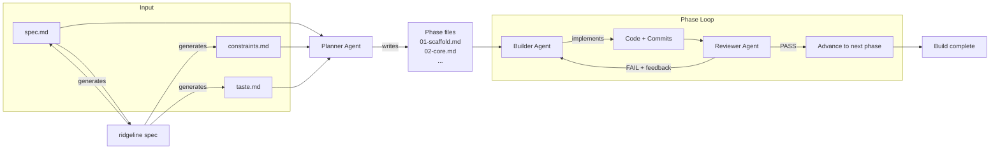
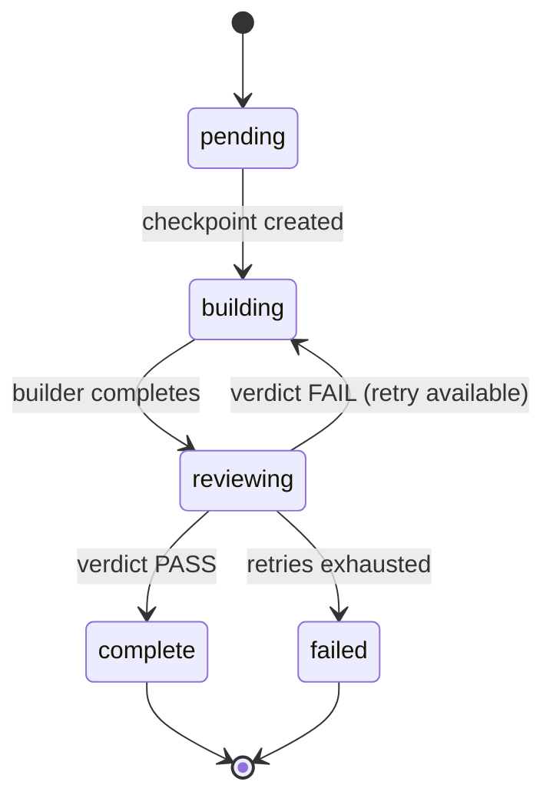
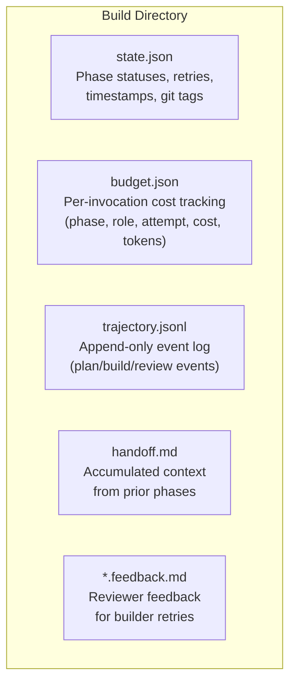

# Architecture

Ridgeline is a build harness for long-horizon software execution. It
decomposes large software projects into phased builds using a three-agent
system -- planner, builder, reviewer -- driven by the Claude CLI. The harness
manages state through git checkpoints, tracks costs, and supports resumable
execution when things go wrong.

Ridgeline itself is lightweight: a single runtime dependency (commander for
CLI parsing) and the Claude CLI installed on the host. Everything else --
planning, implementation, verification -- is delegated to Claude agents with
scoped tool permissions.

## Pipeline Flow



Each phase gets a fresh Claude context window. The builder receives the phase
spec, constraints, taste, and an accumulated handoff file carrying context from
prior phases. The reviewer inspects the builder's git diff against acceptance
criteria and produces a structured verdict.

## Agent Roles and Permissions

Each agent has a focused role and scoped tool access enforced by the Claude CLI.

| Agent | Role | Tools | Notes |
|-------|------|-------|-------|
| **Specifier** | Interactive Q&A to scaffold spec files | Read, Write, Glob, Grep | Only active during `ridgeline spec` |
| **Planner** | Decomposes spec into numbered phase files | Write | Cannot read the codebase; works from spec alone |
| **Builder** | Implements a single phase spec | Read, Write, Edit, Bash, Glob, Grep, Agent | Full access; sandbox optional |
| **Reviewer** | Verifies phase output against acceptance criteria | Read, Bash, Glob, Grep, Agent | Read-only to project files; produces JSON verdict |

The permission boundaries are enforced at invocation time via Claude CLI's
`--allowedTools` flag, not just by prompt instruction.

## Phase Lifecycle



For each phase:

1. **Checkpoint.** The harness commits any dirty working tree and creates a git
   tag (`ridgeline/checkpoint/<build>/<phase>`). This is the rollback point.

2. **Build.** The builder agent receives the phase spec, constraints, taste,
   accumulated handoff, and (on retry) the reviewer's feedback. It implements
   the phase, runs the check command, commits incrementally, and appends to
   handoff.md.

3. **Review.** The reviewer agent receives the phase spec, the git diff from
   checkpoint to HEAD, and constraints. It walks each acceptance criterion,
   runs verification commands, and produces a structured JSON verdict.

4. **Verdict.**
   - **PASS**: the harness creates a completion tag
     (`ridgeline/phase/<build>/<phase>`), updates state.json, and advances to
     the next phase.
   - **FAIL**: the harness generates a feedback file from the verdict and
     retries the builder (up to `--max-retries`, default 2).
   - **Retries exhausted**: the phase is marked failed and the build halts with
     recovery instructions.

## Specialist Sub-agents

Builders and reviewers can delegate to specialist sub-agents for focused tasks.
Specialists are discovered at runtime by scanning agent directories for
markdown files with valid frontmatter.

| Specialist | Model | Purpose |
|------------|-------|---------|
| **checker** | sonnet | Runs check commands, lint, type-check, tests. Can auto-fix mechanical issues. |
| **navigator** | sonnet | Read-only codebase exploration. Returns structured briefings on targeted areas. |
| **tester** | sonnet | Writes acceptance-level tests from criteria. |
| **depender** | sonnet | Checks module graph integrity -- circular deps, unresolved imports. Read-only. |

Specialists use sonnet by default for cost efficiency. They run in their own
context window, keeping the builder's context clean.

## State Management

All build state lives under `.ridgeline/builds/<build-name>/`:



- **state.json** -- tracks each phase's status (`pending`, `building`,
  `reviewing`, `complete`, `failed`), checkpoint and completion git tags, retry
  count, and timestamps. Used by `ridgeline build` to resume from the last
  successful phase.

- **budget.json** -- records every Claude invocation: phase, role (planner,
  builder, reviewer), attempt number, cost in USD, input/output tokens, and
  duration. Running total enables `--max-budget-usd` enforcement.

- **trajectory.jsonl** -- append-only event log. Event types: `plan_start`,
  `plan_complete`, `build_start`, `build_complete`, `review_start`,
  `review_complete`, `phase_advance`, `phase_fail`, `budget_exceeded`. Each
  entry includes timestamp, duration, token counts, cost, and a summary.

- **handoff.md** -- the context bridge between phases. Append-only. After each
  phase, the builder appends a structured section (what was built, decisions,
  deviations, notes for next phase). The next builder reads the full
  accumulated handoff before starting.

- **feedback files** -- `<phase>.feedback.md` is the current feedback for the
  builder's retry. Prior attempts are archived as `<phase>.feedback.0.md`,
  `<phase>.feedback.1.md`, etc. Generated by the harness from the reviewer's
  structured verdict.

## Config Resolution

Constraints and taste files resolve through a three-tier precedence chain:

1. **CLI flag** -- `--constraints <path>` or `--taste <path>`
2. **Build-level** -- `.ridgeline/builds/<build-name>/constraints.md`
3. **Project-level** -- `.ridgeline/constraints.md`

Other configuration (model, timeout, retries, budget, sandbox) comes from CLI
flags with hardcoded defaults:

| Setting | Default |
|---------|---------|
| `--model` | `opus` |
| `--timeout` | `120` minutes per phase |
| `--check-timeout` | `1200` seconds |
| `--max-retries` | `2` |
| `--max-budget-usd` | none (unlimited) |
| `--sandbox` | off |
| `--allow-network` | off |

## Build Directory Structure

```text
.ridgeline/
├── constraints.md                  # Project-level constraints (shared across builds)
├── taste.md                        # Project-level taste (shared across builds)
├── plugin/                         # Project-level plugins (optional)
└── builds/
    └── <build-name>/
        ├── spec.md                 # What to build
        ├── constraints.md          # Build-level constraints (overrides project-level)
        ├── taste.md                # Build-level taste (optional)
        ├── phases/
        │   ├── 01-scaffold.md      # Phase spec (generated by planner)
        │   ├── 01-scaffold.feedback.md   # Current feedback (generated on review failure)
        │   ├── 01-scaffold.feedback.0.md # Archived feedback from attempt 0
        │   ├── 02-core.md
        │   └── ...
        ├── state.json              # Phase statuses, retries, timestamps, git tags
        ├── budget.json             # Per-invocation cost tracking
        ├── trajectory.jsonl        # Event log
        ├── handoff.md              # Context passed to the next phase
        └── plugin/                 # Build-level plugins (optional)
```

## Plugin System

Ridgeline supports Claude CLI plugins at two levels:

- **Project-level**: `.ridgeline/plugin/`
- **Build-level**: `.ridgeline/builds/<build-name>/plugin/`

If a plugin directory exists but has no `plugin.json`, ridgeline auto-generates
a temporary manifest and cleans it up after the invocation. Plugin directories
are passed to the Claude CLI via `--plugin-dir` for builder and reviewer
agents, enabling custom skills, agents, commands, hooks, and MCP server
integrations.

## Claude CLI Integration

Ridgeline does not call model APIs directly. It spawns the Claude CLI as a
child process:

```text
claude -p --output-format stream-json --model <name> --system-prompt <prompt> \
  --allowedTools <tools> [--agents <json>] [--plugin-dir <path>] [--verbose]
```

The user prompt is piped via stdin. Stdout emits newline-delimited JSON events,
including streaming assistant text and a final result event containing the
response, cost, token usage, duration, and session ID.

In sandbox mode (`--sandbox`), the entire Claude invocation is wrapped in
`bwrap` (bubblewrap) for kernel-level isolation:

- Entire filesystem mounted read-only
- Repo root and `/tmp` mounted read-write
- Network blocked by default (`--unshare-net`), allowed with `--allow-network`
- Process dies with parent (`--die-with-parent`)

Sandbox mode requires Linux with bwrap installed.
