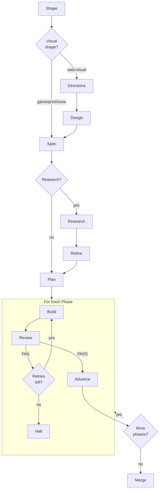

# Build Lifecycle

A Ridgeline build moves through a defined sequence: spec, plan, build, review,
and completion. This document walks through each step -- what happens, what the
user sees, and where the user can intervene.

## Overview



Directions, design, research, and refine are optional. The visual stages
(directions, design) only apply to projects with a visual surface. Skipping
research/refine goes straight from spec to plan.

The user describes what to build. The shaper gathers context. The specifier
ensemble produces spec files. The planner ensemble decomposes the spec into
phases. The builder implements each phase. The reviewer verifies it. Failed
phases are retried with feedback. On success, the worktree merges back to the
user's branch.

## Step 1: Shape

```sh
ridgeline shape my-feature "Build a REST API for task management"
```

The shaper agent analyzes your codebase (language, framework, structure) and
asks clarifying questions across up to 4 rounds. It produces `shape.md` -- a
structured document covering project context, intent, scope, risks, existing
landscape, and technical preferences.

The optional input argument can be a file path to an existing document or a
natural language description. If provided, the shaper uses it to pre-populate
its understanding and skip or reduce its clarification rounds.

**What to review before proceeding:** Read `shape.md`. The shape document is
the primary input to the specifier ensemble -- inaccuracies here cascade
through the entire pipeline.

## Step 1.5: Directions and Design (optional, visual builds)

For builds whose `shape.md` matches a visual category (web-visual,
game-visual, or print-layout), two optional stages run before spec:

**Directions** (`ridgeline directions <name>`, web-visual only) generates
2-3 differentiated visual direction options as self-contained HTML demos.
Each direction lives in a different visual school with a named reference
work. You open the demos in a browser, pick one, and the picked direction's
tokens.md and brief.md become seed context for the design Q&A. See
[Directions](directions.md).

**Design** (`ridgeline design <name>`) runs an interactive Q&A focused on
visual concerns -- color, typography, spacing, motion, asset conventions.
Produces `design.md`. If a picked direction or `references/visual-anchors.md`
is present, the designer uses them as seed context. See [Design](design.md)
and [References and Anchors](references-and-anchors.md).

**What to review before proceeding:** Read `design.md`. Hard tokens (with
imperative language like "must", "always", "required") become non-negotiable
gate checks during visual review. Soft guidance ("prefer", "lean toward") is
best-effort. Get the hard/soft distinction right before planning.

## Step 2: Spec

```sh
ridgeline spec my-feature
```

The specifier ensemble runs three specialist agents in parallel -- completeness,
clarity, and pragmatism -- each producing a draft proposal. A synthesizer agent
merges the proposals into the three input files:

- **spec.md** -- what to build (features, behaviors, acceptance criteria)
- **constraints.md** -- technical guardrails (language, framework, structure,
  check command)
- **taste.md** -- style preferences (optional)

Files are written to `.ridgeline/builds/my-feature/`. The user can also author
these files directly -- the specifier is a convenience, not a requirement.

**What to review before proceeding:** Read the generated files. Tighten
acceptance criteria -- vague criteria produce vague results. Ensure the check
command in constraints actually works on your codebase.

## Step 3: Research (optional)

```sh
ridgeline research my-feature              # default: 2 specialists
ridgeline research my-feature --quick      # quick mode (1 specialist)
ridgeline research my-feature --thorough   # thorough mode (3 specialists)
```

The research ensemble investigates the spec against external sources --
academic papers, framework documentation, and competitive products. Before
dispatching specialists, a lightweight agenda step evaluates the spec against a
domain gap checklist (`gaps.md`) to focus the search on what's actually missing.
By default, 2 specialists (a random pair from academic, ecosystem, competitive)
run in parallel. `--quick` drops to the ecosystem specialist alone for a fast
sanity check; `--thorough` dispatches all three with two-round cross-annotation.
A synthesizer merges the reports into `research.md` — unless the specialists'
structured `findings` / `openQuestions` skeletons agree, in which case
synthesis is skipped and the first specialist's prose is promoted directly.

Research findings accumulate across iterations -- each run appends new findings
to a Findings Log rather than overwriting prior work. Active Recommendations
are rewritten each iteration based on all findings.

Auto mode (`--auto [N]`) chains research and refine for N iterations (default 2),
progressively improving the spec.

See [Research and Refine](research.md) for full details.

**What to review before proceeding:** Read `research.md`. Remove irrelevant
findings, add your own notes. The refiner works from whatever is in
`research.md`, so your edits are incorporated.

## Step 4: Refine (optional)

```sh
ridgeline refine my-feature
```

The refiner agent reads `spec.md` and `research.md`, then rewrites `spec.md`
incorporating the research findings. It also writes `spec.changelog.md`
documenting what changed and why, with source citations. Both the researcher
and refiner read the changelog on subsequent iterations to avoid redundant work.

The refiner is additive by default -- it adds insights and edge cases without
removing user-authored content. Sources are cited inline so you can trace what
came from research. It does not modify `constraints.md` or `taste.md`.

**What to review before proceeding:** Read the updated `spec.md`. Check that
research additions are accurate and within scope. The refiner flags conflicts
with existing spec decisions rather than silently overriding them -- review
these flagged sections carefully.

## Step 5: Plan

```sh
ridgeline plan my-feature
```

The planner decomposes the spec into sequential phases. Ridgeline uses ensemble
planning: three specialist planners (simplicity, velocity, thoroughness) run in
parallel, then a synthesizer merges their proposals. An adversarial
**plan-reviewer** then audits the synthesized plan against a checklist
(per-phase budget, verifiable acceptance criteria, coherent boundaries,
declared `## Required Tools` and `## Required Views`, no scope creep,
no implementation details). If issues are found, the synthesizer runs a
one-shot revision pass before the phase files are written to disk.

Phase files land in `.ridgeline/builds/my-feature/phases/`:

```text
phases/
├── 01-scaffold.md
├── 02-core-api.md
├── 03-auth.md
└── 04-integration.md
```

Each phase file contains a goal, context, and numbered acceptance criteria. The
planner sizes phases to roughly 50% of the builder model's context window,
leaving headroom for codebase exploration and tool use.

**What the user sees:** Specialist invocations (with cost), synthesis progress,
and a listing of the generated phase files.

**What to review before proceeding:** Read the phase files. Check that phases
are ordered with dependencies flowing forward. Adjust scope, merge or split
phases, or edit acceptance criteria as needed. Phase files are plain markdown --
edit freely.

To preview the plan without executing:

```sh
ridgeline dry-run my-feature
```

## Step 6: Build

```sh
ridgeline build my-feature
```

The harness creates a git worktree at `.ridgeline/worktrees/my-feature/` on a
`ridgeline/wip/my-feature` branch, then iterates through phases sequentially.

For each phase:

1. **Checkpoint.** The harness commits any dirty state and creates a git tag
   (`ridgeline/checkpoint/my-feature/01-scaffold`). This is the rollback point.

2. **Builder invocation.** The builder agent receives the phase spec,
   constraints, taste, accumulated handoff from prior phases, and (on retry)
   feedback from the reviewer. It implements the phase using full tool access:
   reading files, writing code, running commands, delegating to specialist
   agents.

3. **Check command.** If constraints specify a check command (e.g.,
   `npm test && npm run typecheck`), the builder runs it before finishing.

4. **Commit and handoff.** The builder commits its work and appends to
   `handoff.md` -- a structured summary of what was built, decisions made,
   deviations from the spec, and notes for the next phase.

**What the user sees:** Streaming builder output in real-time, phase progress
indicators, and per-phase cost summaries.

## Step 7: Review

After the builder completes each phase, the reviewer runs automatically.

The reviewer receives the phase spec, the git diff from checkpoint to HEAD,
and constraints. It walks each acceptance criterion, runs verification
commands, and produces a structured JSON verdict with per-criterion
pass/fail, blocking issues, and suggestions.

For phases that touch visual code, the reviewer dispatches the
**visual-reviewer** specialist before producing its verdict. Visual-reviewer
scores rendered output against design.md and any visual anchors across
five dimensions (taste fidelity, motion discipline, information hierarchy,
convention adherence, anti-slop) and returns Keep / Fix / Quick Wins. The
reviewer composes the critique into the final verdict per the thresholds
documented in [Visual Review](visual-review.md). A failing visual review is
a phase failure even if every acceptance criterion passes.

- **PASS:** All criteria met, no blocking issues, visual review (when
  applicable) within thresholds. The harness creates a completion tag and
  advances to the next phase.
- **FAIL:** The harness generates a feedback file and retries the builder.

**What the user sees:** A verdict summary showing which criteria passed,
which failed, and any blocking issues with evidence.

## Step 8: Retry or Advance

When a phase fails review, the harness writes a feedback file
(`<phase>.feedback.md`) from the structured verdict. The builder retries with a
fresh context window containing the same inputs plus this feedback. The feedback
targets the builder's attention on what specifically needs fixing.

Retries are capped (default: 2, configurable via `--max-retries`).[^1] If all
retries are exhausted:

- The phase is marked as `failed` in state.json.
- The build halts.
- The worktree is left intact for inspection.
- The user receives recovery instructions.

The user can then inspect the code, edit the phase spec or constraints, and
re-run `ridgeline build my-feature`. The harness resumes from the failed phase.[^2]

## Resume: Two Independent Tiers

Ridgeline's resume model has two independent tiers that never overlap or
share files. They serve different timescales and are owned by different
parts of the substrate.

**Outer (cross-process) resume — state.json + git tags.** Owned
exclusively by `src/stores/state.ts` and `src/stores/tags.ts`. Survives
process exit, machine reboot, network outage, and SIGINT. When the user
re-runs `ridgeline build <name>`, the harness reads
`.ridgeline/builds/<name>/state.json` plus the build's git tags
(`ridgeline/checkpoint/<build>/<phase>` and
`ridgeline/phase/<build>/<phase>`) to determine which phases are
already `complete` and which to restart from. This contract is preserved
unchanged across the substrate migration.

**Inner (intra-run) memoization — fascicle CheckpointStore.** Owned by
the fascicle core and adapted to ridgeline's filesystem layout via
`createRidgelineCheckpointStore(buildDir)`. Writes only under
`.ridgeline/builds/<name>/state/<step-id>.json` -- never under
`state.json`, never as a git tag. Lets a single in-process fascicle
flow skip already-completed steps when a step retries or a flow
restarts within the same process. Disposable: the inner directory can
be deleted between runs without harming outer resume.

The two tiers are deliberately disjoint. `state.json` and the git tags
are the sole source of truth for cross-process resume; the
`<buildDir>/state/` directory is sole source of truth for in-process
step memoization. They never read or write each other's files. This is
enforced by review and by the path scoping inside each adapter.

```text
.ridgeline/builds/<build-name>/
├── state.json            ← outer resume (stores/state.ts)
├── state/                ← inner memoization (fascicle CheckpointStore)
│   ├── builder.json
│   ├── reviewer.json
│   └── ...
├── trajectory.jsonl      ← event log (translated from fascicle events)
└── ...
```

Why two tiers? Outer resume is durable but coarse — it tracks whole
phases. Inner memoization is fine-grained but ephemeral — it tracks
individual steps within a single fascicle `run()` invocation. Both are
useful; sharing state between them would couple their lifecycles in
ways that make either layer harder to reason about.

## Step 9: Completion

When all phases pass:

1. The worktree's WIP branch is fast-forward merged back to the user's branch.
2. All ridgeline git tags for this build are cleaned up.
3. A build summary is printed: total cost, total duration, per-phase breakdown
   (cost, duration, retries).

The build directory (`.ridgeline/builds/my-feature/`) is preserved with all
state files -- state.json, budget.json, trajectory.jsonl, handoff.md, and phase
files. This is the build's audit trail.

To clean up worktrees from completed or abandoned builds:

```sh
ridgeline clean
```

## Intervention Points

Ridgeline's pipeline is autonomous during execution, but the user has control
at several points:

**Between spec and plan (research/refine).** Optionally run
`ridgeline research` and `ridgeline refine` to enrich the spec with external
sources before planning. You can also edit `research.md` between research and
refine to curate the findings.

**Between spec and plan (manual edits).** Edit spec.md, constraints.md, and
taste.md before planning. The planner works from these files, so changes here
cascade through the entire build.

**Between plan and build.** Edit phase files in `phases/`. Adjust scope, rewrite
acceptance criteria, reorder phases, add or remove phases. Phase files are plain
markdown.

**Between build attempts.** When a build fails and halts, the worktree is
intact. The user can:

- Edit code in the worktree directly (fix what the builder could not).
- Edit the phase spec or constraints.
- Adjust `--max-retries` or `--max-budget-usd`.
- Re-run `ridgeline build my-feature` to resume from the failed phase.

**During build (budget control).** The `--max-budget-usd` flag halts the build
if cumulative cost exceeds the threshold. This prevents runaway spending on
phases that are not converging.

**After completion.** Inspect the merged result on your branch. Review the git
history (each phase's commits are preserved). Check budget.json for cost
analysis. Read trajectory.jsonl for the full event log.[^3]

[^1]: **Further reading:** [Timeouts, Retries, and Backoff with Jitter](https://aws.amazon.com/builders-library/timeouts-retries-and-backoff-with-jitter/) — AWS builders' library on retry strategies, including why capping retries and adding structured backoff prevents cascading failures.
[^2]: **Further reading:** [Event Sourcing Pattern](https://learn.microsoft.com/en-us/azure/architecture/patterns/event-sourcing) — The checkpoint-and-resume model mirrors event sourcing, where state is reconstructed from an append-only log of events rather than mutable snapshots.
[^3]: **Further reading:** [Building Effective Harnesses for Long-Running Agents](https://www.anthropic.com/engineering/effective-harnesses-for-long-running-agents) — Anthropic's guidance on trajectory logging and cost attribution as essential observability for agent harnesses.
