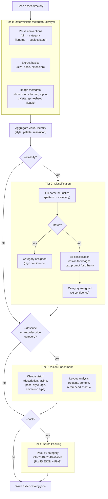

# Asset Catalog

The catalog command indexes media assets into a structured metadata file
(`asset-catalog.json`) that feeds into the design and build stages. It does
not copy or move files -- it scans them in place, extracts metadata, and
writes a JSON index.

## Supported Media Types

| Type | Extensions |
|------|-----------|
| Image | PNG, JPG, JPEG, GIF, WebP, SVG, AVIF |
| Audio | MP3, WAV, OGG, FLAC, AAC, M4A |
| Video | MP4, WebM, MOV, AVI |
| Text | TXT, JSON, CSV, MD, YAML, YML |

## The Four Tiers

The catalog runs in tiers. Each tier adds richer metadata on top of the
previous one.



### Tier 1: Deterministic Metadata

Always runs. No AI involved.

**Convention parsing** infers structure from the filesystem:

```text
characters/knight-walk.png
    ↓
category: "characters"   (from parent directory)
name:     "knight-walk"
subject:  "knight"        (first segment before hyphen)
state:    "walk"          (remaining segments)
```

Files in the root of the asset directory default to category "uncategorized".

**Basic metadata** for all media types: file size, extension, and an MD5
content hash for incremental change detection.

**Image-specific metadata** (via Sharp and ColorThief):

| Property | How it's detected |
|----------|-------------------|
| Dimensions | Sharp metadata |
| Format | Sharp metadata (png, jpeg, svg, etc.) |
| Alpha channel | Sharp metadata |
| Dominant color | ColorThief |
| 6-color palette | ColorThief |
| Spritesheet | Dimension heuristic: one dimension is an exact multiple of the other |
| Frame count/direction | Derived from spritesheet dimensions |
| Tileable | Edge pixel comparison: >85% similarity between opposing edges |

**Category defaults** -- each category has suggested z-layer and anchor values
optimized for typical game engine usage:

| Category | Z-Layer | Anchor |
|----------|---------|--------|
| characters | entity | bottom-center |
| tiles | ground | top-left |
| items | entity | center |
| ui | ui | center |
| backgrounds | background | top-left |
| effects | foreground | center |
| layouts | ui | top-left |

**Visual identity aggregates** are computed across all assets:

- **Detected style**: "pixel-art" if >60% of images are small (≤128px),
  "vector" if >50% are SVGs, null otherwise.
- **Detected palette**: top 8 most frequent colors across all assets.
- **Detected resolution**: most common square dimensions (max 256px).
- **Detected scaling**: "nearest" for pixel-art, null otherwise.
- **Palette warnings**: colors in assets that don't appear in `design.md`
  (if a design document exists).

### Tier 2: Classification

Runs with `--classify`. Assigns categories to files that Tier 1 left as
"uncategorized".

**Stage 1: Filename heuristics** (fast, no AI):

| Media | Prefix patterns | Category |
|-------|----------------|----------|
| Image | `bg_*`, `background_*`, `sky_*` | backgrounds |
| Image | `btn_*`, `button_*`, `icon_*`, `hud_*` | ui |
| Image | `tile_*`, `floor_*`, `wall_*`, `terrain_*` | tiles |
| Image | `char_*`, `character_*`, `player_*`, `enemy_*` | characters |
| Image | `item_*`, `pickup_*`, `loot_*`, `potion_*` | items |
| Image | `fx_*`, `effect_*`, `particle_*`, `explosion_*` | effects |
| Image | `layout_*`, `mockup_*`, `wireframe_*` | layouts |
| Audio | `bgm_*`, `music_*`, `track_*` | music |
| Audio | `sfx_*`, `click_*`, `hit_*`, `jump_*` | sfx |
| Audio | `ambient_*`, `ambience_*`, `wind_*` | ambience |
| Audio | `voice_*`, `dialogue_*`, `narrat_*` | dialogue |
| Video | `cutscene_*`, `cinematic_*`, `intro_*` | cinematics |
| Text | `dialogue_*`, `script_*` | dialogue |
| Text | `doc_*`, `readme_*`, `guide_*` | docs |
| Text | `.json`, `.csv`, `.yaml`, `.yml` (by extension) | data |

Heuristic matches are assigned "high" confidence.

**Stage 2: AI classification** (when heuristics don't match):

- Images: Claude vision with the full image
- Audio/video/text: text-only prompt with filename, extension, and file size
  (plus a content preview for text files)
- Returns a category and confidence level (high/medium/low)
- Falls back to "uncategorized" on timeout or error

### Tier 3: Vision Enrichment

Runs with `--describe` for all image assets, or automatically for `layouts`
and `ui` categories regardless of the flag.

Claude vision analyzes each image and returns structured metadata:

**Regular images:**

- Visual description
- Subject identification
- Facing direction (left/right/up/down/front/camera/n-a)
- Pose or state (idle/walking/attacking/dead/n-a)
- Style tags (pixel-art, 32x32, top-down, etc.)
- Animation type (loop/once/ping-pong)
- Suggested anchor and z-layer
- Can override Tier 1 spritesheet detection if it disagrees

**Layout mockups** (category "layouts"):

- Overall layout description
- Spatial region analysis (top-left, center, bottom-center, etc.)
- Content description per region
- Referenced asset paths (if identifiable)
- Marked as reference-only (excluded from sprite packing)

### Tier 4: Sprite Packing

Runs with `--pack`. Uses an in-house packer (`maxrects-packer` + `sharp`) to
produce PixiJS-compatible sprite atlases.

- Groups assets by category
- Packs into 2048×2048 PNG atlases with JSON metadata
- Output: `<asset-dir>/packed/<category>.png` + `<category>.json`
- Settings: 1px padding, no rotation, automatic duplicate detection, trimming
- **Excluded**: backgrounds (too large) and layouts (reference-only)

## Incremental Builds

The catalog tracks each file's MD5 content hash. On subsequent runs:

- **Unchanged files** are skipped -- their existing metadata is reused
- **New files** are fully processed
- **Modified files** (hash changed) are re-processed
- **Deleted files** are pruned from the catalog
- **Vision descriptions** persist across runs for unchanged files

Use `--force` to re-process everything regardless of hash.

The summary output shows what changed:

```text
Asset catalog complete:
  42 assets total
  + 3 new
  ~ 1 updated
  = 37 unchanged
  - 1 pruned
  * 2 classified by AI
```

## Asset Directory Resolution

The catalog looks for assets in this order:

1. `--asset-dir <path>` (explicit flag)
2. `.ridgeline/builds/<build-name>/assets/`
3. `.ridgeline/assets/`
4. `assetDir` field in `.ridgeline/settings.json`

If none are found, the catalog command exits with an error.

## Integration with the Pipeline

The catalog feeds into two downstream stages:

**Design** -- the designer auto-runs the catalog if assets exist but no
catalog has been built. The catalog summary (style, palette, resolution,
category breakdown) is injected into the designer's context so it can propose
grounded design tokens.

**Build** -- builders reference `asset-catalog.json` for asset paths,
dimensions, categories, and conventions during implementation.

## Workflows

### Quick inventory

Index assets and see what you have:

```sh
ridgeline catalog my-game
```

### Full enrichment

Classify, describe, and pack:

```sh
ridgeline catalog my-game --classify --describe --pack
```

### Iterative refinement

Run a basic catalog first, then add enrichment as needed:

```sh
ridgeline catalog my-game                    # Tier 1 only
ridgeline catalog my-game --classify         # Add classification
ridgeline catalog my-game --describe --pack  # Add vision + packing
```

Each run is incremental -- only new or changed files are re-processed.

### Pre-design workflow

Catalog assets before the design stage for richer design context:

```sh
ridgeline catalog my-game --classify
ridgeline design my-game    # Designer sees catalog summary
ridgeline spec my-game
```

## CLI Reference

### `ridgeline catalog [build-name]`

Index media assets into `asset-catalog.json`.

| Flag | Default | Description |
|------|---------|-------------|
| `--asset-dir <path>` | auto | Path to asset directory |
| `--classify` | off | AI-classify uncategorized files into categories |
| `--describe` | off | Add vision-based descriptions for all image assets |
| `--pack` | off | Generate sprite atlases after cataloging |
| `--batch` | off | Batch multiple images per vision call |
| `--force` | off | Re-process all assets ignoring content hash |
| `--model <name>` | `opus` | Model for vision and classification |
| `--timeout <minutes>` | `5` | Max duration per AI call |

## Cost

AI-powered tiers add cost. Tier 1 (deterministic) is free.

| Operation | Claude calls | When |
|-----------|-------------|------|
| Classification (heuristic) | 0 | `--classify`, pattern matches |
| Classification (AI) | 1 per file | `--classify`, no pattern match |
| Vision enrichment | 1 per image | `--describe` or auto-describe category |
| Sprite packing | 0 | `--pack` |

Auto-describe categories (`layouts` and `ui`) incur vision calls even without
`--describe`. Use `--batch` to reduce call count by grouping multiple images
per vision invocation.

All costs are tracked in `budget.json` under the `catalog` role.
