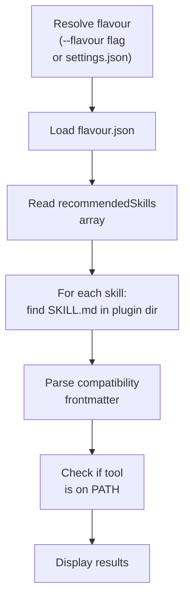

# Check

The check command verifies that recommended tools for a flavour are installed
on your system. It reads the flavour's configuration, looks up each
recommended tool, and reports which are available and which are missing.

```sh
ridgeline check --flavour game-dev
```

## Why Check Exists

Flavours can recommend external tools that improve build quality. A game
development flavour might recommend an image optimizer or a tilemap editor. A
web UI flavour might recommend a specific linter or accessibility checker.
These tools are optional -- ridgeline works without them -- but results
improve when they're available.

The check command surfaces these recommendations before you start building,
so you can install missing tools upfront rather than discovering gaps
mid-build.

## How It Works



1. **Resolve the flavour.** From the `--flavour` flag or the `flavour` field
   in `.ridgeline/settings.json`.
2. **Load `flavour.json`.** Each flavour directory can contain a
   `flavour.json` with a `recommendedSkills` array listing skill names.
3. **Find skill definitions.** For each recommended skill, the check command
   locates its `SKILL.md` file in the bundled plugin directory.
4. **Parse compatibility.** Each `SKILL.md` can declare a `compatibility`
   field in its YAML frontmatter, specifying what external tool it requires
   (e.g., "Requires imagemagick (brew install imagemagick)").
5. **Probe the system.** The check command runs `command -v <tool>` to test
   whether each required tool is available on PATH.
6. **Report.** Displays a list of tools with their availability status, plus
   install commands for anything missing.

## Example Output

```text
  Flavour: game-dev

  Recommended tools for this flavour:
    ✓ sprite-packer        (found)
    ✓ image-optimizer      (found)
    ✗ tilemap-editor       (not found)

  Install missing tools:
    npm install -g tilemap-editor

  These are optional — ridgeline works
  without them, but results improve with
  them installed.
```

## Flavour Configuration

A flavour declares its recommended skills in `flavour.json`:

```json
{
  "recommendedSkills": ["sprite-packer", "image-optimizer", "tilemap-editor"]
}
```

Each skill's `SKILL.md` declares its external dependency:

```yaml
---
name: tilemap-editor
compatibility: Requires tilemap-editor (npm install -g tilemap-editor)
---
```

The `compatibility` string follows the pattern
`Requires <tool-name> (<install-command>)`. The check command extracts both
the tool name (for probing) and the install command (for display).

## When to Run Check

- **Before your first build with a new flavour.** See what tools are
  recommended and install them upfront.
- **After setting up a new development environment.** Verify that all
  expected tools are available.
- **When a build produces unexpected results.** A missing recommended tool
  might explain why certain optimizations or checks were skipped.

## CLI Reference

### `ridgeline check`

Check recommended tools and prerequisites for a flavour.

| Flag | Default | Description |
|------|---------|-------------|
| `--flavour <name-or-path>` | from settings | Agent flavour to check |

If no flavour is specified via flag or settings, the command reports that no
flavour is configured and exits.
