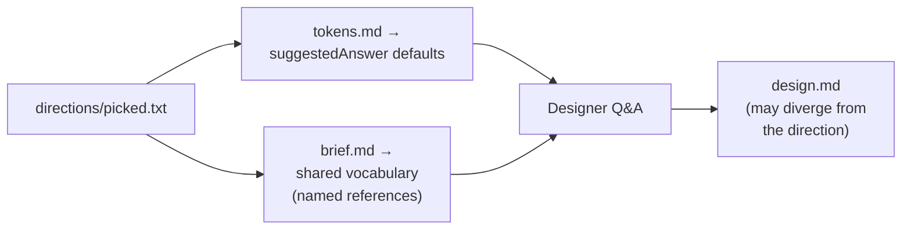
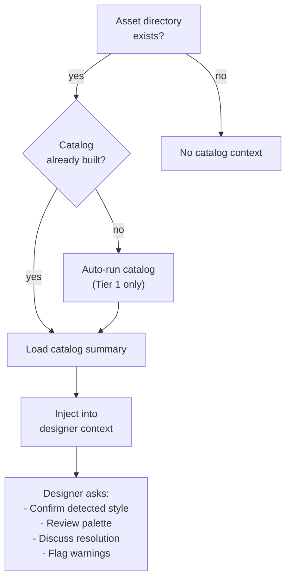

# Design

The design stage establishes a visual design system for your project. It
produces `design.md` -- a freeform document that carries design tokens, style
guidance, and visual conventions through the rest of the pipeline. Builders
and reviewers reference it alongside the spec and constraints.

Design sits between shape and spec in the pipeline. For web-visual builds,
the optional `directions` stage runs first to pre-seed it:

```text
shape → [directions] → [design] → spec → [research → refine] → plan → build
```

Like research and refine, design is optional. Auto-advance
(`ridgeline my-feature`) opts in to design when the shape matches a visual
category (web/game/print). Backend builds skip design entirely.

For full coverage of the directions stage, see [Directions](directions.md).
For reference imagery and visual anchors, see
[References and Anchors](references-and-anchors.md).

## Why Design Exists

Without a design document, the builder makes visual decisions ad hoc during
each phase. Typography, color palette, spacing, component style -- all
invented on the fly and potentially inconsistent across phases. The design
stage front-loads these decisions into a single document that every downstream
agent can reference.

This matters most for projects with a visual surface: web UIs, games, mobile
apps, printed documents. For a CLI tool or a backend API, you probably don't
need a design stage.

## The Conversation

The design command runs an interactive Q&A session -- the same intake pattern
as the shaper, but focused exclusively on visual concerns.

```sh
ridgeline design my-game
```

The designer agent gathers existing context before asking questions:

1. **Existing design.md** -- if a project-level or build-level design document
   already exists, the designer reads it and offers to refine or extend rather
   than starting from scratch.
2. **shape.md** -- the shape document from the previous stage, providing project
   context.
3. **Picked direction** -- if `directions/picked.txt` exists from a prior
   `ridgeline directions` run, the designer reads the picked direction's
   `tokens.md` and `brief.md` and uses its hex codes, font choices, corner
   radii, and motion rules as `suggestedAnswer` defaults. The picked direction
   is a starting point, not a hard lock — Q&A still happens, but the defaults
   land in the picked territory.
4. **Visual anchors** -- if `references/visual-anchors.md` exists, the designer
   reads the per-reference `anchor_quality` paragraphs and uses them as
   `suggestedAnswer` values where relevant. Anchors are already resolved
   before Q&A starts; the designer does not propose new ones.
5. **Asset catalog** -- if an asset directory exists but no catalog has been
   built, the designer auto-runs `ridgeline catalog` (Tier 1 only) and injects
   the catalog summary into context. This gives the designer concrete data to
   work from: detected art style, color palette, resolution, and asset
   category breakdown.

### Questions by domain

The designer adapts its questions to the project's visual domain. Three
question tracks are built in:

**Web visual projects:**

| Round | Focus | Example questions |
|-------|-------|-------------------|
| 1 | Visual foundation | Color palette, typography, spacing system, breakpoints |
| 2 | Component patterns | Corner radius, shadow depth, interactive states, grid system |
| 3 | Accessibility and polish | WCAG level, motion preferences, dark mode, icon style |

**Game visual projects:**

| Round | Focus | Example questions |
|-------|-------|-------------------|
| 1 | Art direction | Art style, palette mood, sprite dimensions, shape language, scaling mode |
| 2 | UI and HUD | HUD style, menu design, dialogue boxes, layout regions, mood |
| 3 | Asset integration | Manifest review, background treatment, loading strategy |

**Print layout projects:**

| Round | Focus | Example questions |
|-------|-------|-------------------|
| 1 | Document foundation | Page size, margins, typography, grid system |
| 2 | Visual elements | Image handling, color mode, decorative elements |

Each round asks 3-5 questions. When existing context (design.md, shape.md,
picked direction, visual anchors, or asset catalog) already suggests an
answer, the designer presents it as a suggested answer for you to confirm or
override rather than asking from scratch.

### Seeding from a picked direction

When you run `ridgeline directions` first and pick one of the generated
direction options, the designer lifts that direction's tokens.md as a
starting point:



The designer still asks every question, but its defaults land in the picked
direction's territory — hex codes from the direction's palette, the
direction's typography choices, its corner radius and motion rules. You can
confirm, refine, or override each one.

### Seeding from visual anchors

When `references/visual-anchors.md` is present (produced by a prior
`ridgeline design` run that named references, or written manually), the
designer reads the per-anchor `anchor_quality` paragraphs and treats each
named reference as anchoring a specific visual quality (palette, typography,
spatial composition, motion). Anchors influence `suggestedAnswer` values
where relevant. See [References and Anchors](references-and-anchors.md) for
the workflow that creates these files.

### Asset catalog integration

When asset catalog data is available, the designer uses it to ground its
questions in what actually exists:



The designer proposes palette, style, resolution, and scaling defaults derived
from the catalog's visual identity analysis. If the catalog detected palette
mismatches against an existing design.md, the designer flags them for review.

## What the Designer Produces

At the end of the conversation, the designer writes `design.md`. The format
is deliberately freeform -- it's a markdown document, not a schema. The
designer uses two levels of specificity:

**Hard tokens** are specific values with imperative language. These are
non-negotiable:

```markdown
Primary: #2563EB (must use for all primary actions)
Base spacing unit: 8px (always use multiples of 8)
Headings: Inter (required)
```

**Soft guidance** is directional preference. These are best-effort:

```markdown
Prefer muted, desaturated backgrounds.
Lean toward rounded corners for interactive elements.
Generally avoid pure black (#000) for text.
```

The distinction matters downstream. Reviewers treat hard token violations
as failures and soft guidance deviations as acceptable when justified.

### Example output

```markdown
# Design System

## Colors

Primary: #2563EB (must use for all primary actions)
Secondary: #64748B
Accent: #F59E0B

Neutral scale: slate-50 through slate-900

Prefer muted, desaturated backgrounds. Avoid pure black (#000).

## Typography

Headings: Inter (required)
Body: Inter
Mono: JetBrains Mono

Scale: 12 / 14 / 16 / 20 / 24 / 30 / 36 / 48

## Spacing

Base unit: 8px (always use multiples of 8)
```

The format adapts to the domain. A game project might have sections for sprite
dimensions, animation timing, and HUD layout. A print project might have page
dimensions, bleed areas, and CMYK color values. The designer structures the
document to fit whatever the project needs.

## Project-Level vs Build-Level

Design can operate at two levels:

```sh
ridgeline design my-feature   # Build-level: .ridgeline/builds/my-feature/design.md
ridgeline design               # Project-level: .ridgeline/design.md
```

A **project-level** design document applies to all builds. Use this when the
visual system is shared across features -- a product design system, a game's
art style, a brand guide.

A **build-level** design document applies to a single build. It can extend or
override the project-level design. Both are loaded when they exist -- the
designer sees both and can propose changes to either.

The resolution order downstream (builders and reviewers):

1. Build-level `design.md` (if it exists)
2. Project-level `design.md` (fallback)

## Design and the Catalog

Design and catalog are complementary. The catalog indexes what assets exist
and extracts their properties. The designer uses that data to establish
conventions for how those assets should be used.

A typical workflow for a project with existing assets:

```sh
ridgeline catalog my-game --classify    # Index and classify assets
ridgeline design my-game                # Establish design system (catalog auto-injected)
ridgeline spec my-game                  # Spec references design tokens
ridgeline plan my-game
ridgeline build my-game
```

If you skip the explicit catalog step, the designer auto-runs a basic catalog
(Tier 1 only -- no AI classification or vision descriptions) when it detects
an asset directory. Running catalog explicitly with `--classify` or
`--describe` gives the designer richer data to work with.

## When to Use Design

- **Web UIs.** Consistent color, typography, spacing, and component style
  across phases.
- **Games.** Art direction, sprite conventions, HUD layout, palette
  constraints.
- **Mobile apps.** Platform-appropriate patterns, responsive behavior, motion
  guidelines.
- **Print/document projects.** Page layout, type hierarchy, color mode.

## When to Skip Design

- **Backend services, CLIs, APIs.** No visual surface to design.
- **Small scripts or utilities.** Design overhead isn't justified.
- **Projects with an existing external design system.** If you already have a
  Figma file or brand guide, reference it in the spec or constraints instead.

## CLI Reference

### `ridgeline design [build-name]`

Establish or update a visual design system through interactive Q&A. Produces
`design.md`.

| Flag | Default | Description |
|------|---------|-------------|
| `--model <name>` | from settings, else `opus` | Model for designer agent |
| `--timeout <minutes>` | `10` | Max duration per turn |

## Downstream: visual review

When a phase touches visual code (`apps/**/*.tsx`, `*.svg`, `*.css`,
`tailwind.config.*`, or other rendered surfaces), the reviewer dispatches
the **visual-reviewer** specialist to score the rendered output against
this design.md and any visual anchors. Hard tokens become non-negotiable
gate checks; soft guidance becomes scoring weight. See
[Visual Review](visual-review.md) for the dispatch logic, the five scoring
dimensions, and the pass/fail thresholds.
