# Diagrams

A single, end-to-end view of the Ridgeline pipeline -- from a user's initial
description all the way through to a merged branch. Same diagram in two forms:
ASCII for terminals and plain-text viewers, Mermaid for rendered docs.

## ASCII

```text
                        ┌────────────────────┐
                        │     User input     │
                        │ (description, doc) │
                        └─────────┬──────────┘
                                  │
                                  ▼
                        ┌────────────────────┐
                        │    Shaper agent    │  ridgeline shape
                        │  (Read/Glob/Grep)  │
                        └─────────┬──────────┘
                                  │ writes
                                  ▼
                            ┌──────────┐
                            │ shape.md │
                            └────┬─────┘
                                 │
                                 ▼
   ┌─────────────────── Specifier Ensemble ────────────────────┐
   │   ┌─────────────┐   ┌─────────────┐   ┌─────────────┐     │
   │   │completeness │   │  clarity    │   │ pragmatism  │     │   ridgeline spec
   │   │ specialist  │   │ specialist  │   │ specialist  │     │
   │   └──────┬──────┘   └──────┬──────┘   └──────┬──────┘     │
   │          └─────────────────┼─────────────────┘            │
   │                            ▼                              │
   │                    ┌───────────────┐                      │
   │                    │  Synthesizer  │                      │
   │                    └───────┬───────┘                      │
   └────────────────────────────┼──────────────────────────────┘
                                │ writes
                ┌───────────────┼───────────────┐
                ▼               ▼               ▼
          ┌──────────┐   ┌──────────────┐   ┌─────────┐
          │ spec.md  │   │constraints.md│   │taste.md │
          └────┬─────┘   └──────┬───────┘   └────┬────┘
               │                │                │
               │ ┌──────────────┴────────────────┘
               │ │
               ▼ ▼
         ┌─────────────────┐
         │ Research?       │ ── no ──┐
         └────────┬────────┘         │
                  │ yes              │
                  ▼                  │
   ┌─────── Research Loop (optional, --auto N) ───────┐
   │   ┌──────────────────────────────┐               │
   │   │ Agenda step (sonnet)         │               │   ridgeline research
   │   │ reads spec + gaps.md +       │               │
   │   │ existing research.md         │               │
   │   └─────────────┬────────────────┘               │
   │                 ▼                                │
   │   ┌──────────────────────────────┐               │
   │   │ Research ensemble            │               │
   │   │ academic / ecosystem /       │               │
   │   │ competitive specialists      │               │
   │   └─────────────┬────────────────┘               │
   │                 ▼                                │
   │           ┌───────────────┐                      │
   │           │  research.md  │ ◄── accumulated      │
   │           └───────┬───────┘     across runs      │
   │                   ▼                              │
   │           ┌───────────────┐                      │   ridgeline refine
   │           │ Refiner agent │                      │
   │           └───────┬───────┘                      │
   │                   │ rewrites spec.md             │
   │                   │ writes spec.changelog.md     │
   └───────────────────┼──────────────────────────────┘
                       │
                       ▼                              │
                  (back to spec.md) ──────────────────┘
                       │
                       ▼
   ┌─────────────────── Planner Ensemble ──────────────────────┐
   │   ┌─────────────┐   ┌─────────────┐   ┌─────────────┐     │
   │   │ simplicity  │   │  velocity   │   │thoroughness │     │   ridgeline plan
   │   │ specialist  │   │ specialist  │   │ specialist  │     │
   │   └──────┬──────┘   └──────┬──────┘   └──────┬──────┘     │
   │          └─────────────────┼─────────────────┘            │
   │                            ▼                              │
   │                    ┌───────────────┐                      │
   │                    │  Synthesizer  │                      │
   │                    └───────┬───────┘                      │
   └────────────────────────────┼──────────────────────────────┘
                                │ writes
                                ▼
                  ┌──────────────────────────┐
                  │ Phase files              │
                  │ phases/01-scaffold.md    │
                  │ phases/02-core.md        │
                  │ phases/03-…              │
                  └────────────┬─────────────┘
                               │
                               ▼
   ┌──────────────── Phase Loop (per phase) ──────────────────┐
   │                                                          │
   │   ┌────────────────────────────────────────┐             │
   │   │ Checkpoint                             │             │
   │   │ git tag ridgeline/checkpoint/<b>/<p>   │             │
   │   └─────────────────┬──────────────────────┘             │
   │                     ▼                                    │
   │   ┌────────────────────────────────────────┐             │
   │   │ Builder agent                          │             │   ridgeline build
   │   │ inputs: phase spec, constraints,       │             │
   │   │   taste, handoff.md, feedback (retry)  │             │
   │   │ writes code + commits;                 │             │
   │   │ runs check command;                    │             │
   │   │ appends to handoff.md                  │             │
   │   └─────────────────┬──────────────────────┘             │
   │                     ▼                                    │
   │   ┌────────────────────────────────────────┐             │
   │   │ Reviewer agent                         │             │
   │   │ reads diff (checkpoint..HEAD)          │             │
   │   │ verifies acceptance criteria           │             │
   │   │ produces JSON verdict                  │             │
   │   └─────────┬────────────────────┬─────────┘             │
   │             │                    │                       │
   │           PASS                  FAIL                     │
   │             │                    │                       │
   │             ▼                    ▼                       │
   │   ┌──────────────────┐  ┌──────────────────────┐         │
   │   │ Completion tag   │  │ Write feedback file  │         │
   │   │ ridgeline/phase/ │  │ retries left? ──yes──┼──► back │
   │   │   <b>/<p>        │  │                      │  to     │
   │   │ advance state    │  │ no ──► HALT, leave   │  builder│
   │   └────────┬─────────┘  │ worktree intact      │         │
   │            │            └──────────────────────┘         │
   │            ▼                                             │
   │   more phases? ── yes ─► next phase (top of loop)        │
   │            │                                             │
   │            no                                            │
   └────────────┼─────────────────────────────────────────────┘
                ▼
        ┌────────────────────────────────────┐
        │ Merge                              │
        │ fast-forward ridgeline/wip/<b>     │
        │ back to user's branch              │
        │ clean up ridgeline tags            │
        │ print build summary (cost, time)   │
        └────────────────┬───────────────────┘
                         ▼
                   ┌───────────┐
                   │   Done    │
                   └───────────┘

State written throughout the build (under .ridgeline/builds/<build>/):
  state.json  budget.json  trajectory.jsonl  handoff.md  *.feedback.md
```

## Mermaid

```mermaid
flowchart TB
    input["User input<br/>(description or doc)"] --> shaper

    shaper["Shaper agent<br/>Read / Glob / Grep"] -->|writes| shape["shape.md"]

    shape --> spec_ensemble

    subgraph spec_ensemble ["Specifier Ensemble (ridgeline spec)"]
        direction TB
        s1["completeness specialist"]
        s2["clarity specialist"]
        s3["pragmatism specialist"]
        s_synth["Synthesizer"]
        s1 --> s_synth
        s2 --> s_synth
        s3 --> s_synth
    end

    spec_ensemble -->|writes| spec["spec.md"]
    spec_ensemble -->|writes| constraints["constraints.md"]
    spec_ensemble -->|writes| taste["taste.md"]

    spec --> research_decision{"Research?"}
    constraints --> plan_ensemble
    taste --> plan_ensemble

    research_decision -->|no| plan_ensemble

    research_decision -->|yes| research_loop

    subgraph research_loop ["Research + Refine Loop (optional, --auto N)"]
        direction TB
        agenda["Agenda step (sonnet)<br/>reads spec + gaps.md +<br/>existing research.md"]
        r_ens["Research ensemble<br/>academic / ecosystem / competitive"]
        r_md["research.md<br/>(accumulated across runs)"]
        refiner["Refiner agent"]
        agenda --> r_ens --> r_md --> refiner
        refiner -->|rewrites| spec_back["spec.md"]
        refiner -->|writes| changelog["spec.changelog.md"]
    end

    research_loop --> plan_ensemble

    subgraph plan_ensemble ["Planner Ensemble (ridgeline plan)"]
        direction TB
        p1["simplicity specialist"]
        p2["velocity specialist"]
        p3["thoroughness specialist"]
        p_synth["Synthesizer"]
        p1 --> p_synth
        p2 --> p_synth
        p3 --> p_synth
    end

    plan_ensemble -->|writes| phases["Phase files<br/>phases/01-scaffold.md<br/>phases/02-core.md<br/>..."]

    phases --> phase_loop

    subgraph phase_loop ["Phase Loop — for each phase (ridgeline build)"]
        direction TB
        checkpoint["Checkpoint<br/>git tag ridgeline/checkpoint/&lt;b&gt;/&lt;p&gt;"]
        builder["Builder agent<br/>phase spec + constraints + taste +<br/>handoff.md + feedback (on retry)<br/>writes code, commits, runs check,<br/>appends handoff.md"]
        reviewer["Reviewer agent<br/>diff: checkpoint..HEAD<br/>walks acceptance criteria<br/>JSON verdict"]
        verdict{"Verdict"}
        retry_check{"Retries left?"}
        write_feedback["Write &lt;phase&gt;.feedback.md"]
        complete_tag["Completion tag<br/>ridgeline/phase/&lt;b&gt;/&lt;p&gt;<br/>advance state.json"]
        more{"More phases?"}
        halt["HALT<br/>worktree left intact<br/>recovery instructions"]

        checkpoint --> builder
        builder --> reviewer
        reviewer --> verdict
        verdict -->|PASS| complete_tag
        verdict -->|FAIL| write_feedback
        write_feedback --> retry_check
        retry_check -->|yes| builder
        retry_check -->|no| halt
        complete_tag --> more
        more -->|yes| checkpoint
    end

    phase_loop -->|all phases PASS| merge["Merge<br/>fast-forward ridgeline/wip/&lt;b&gt;<br/>onto user's branch<br/>clean up ridgeline tags<br/>print build summary"]

    merge --> done(["Done"])

    state_note["State throughout build (.ridgeline/builds/&lt;b&gt;/):<br/>state.json · budget.json · trajectory.jsonl ·<br/>handoff.md · *.feedback.md"]
    phase_loop -.-> state_note
```


