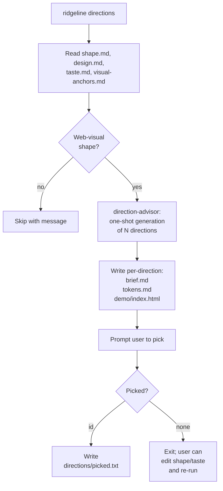

# Directions

The directions stage generates 2-3 differentiated visual direction options
as code mockups before design Q&A. The user opens each demo in a browser,
picks one, and the picked direction's tokens become seed context for the
design conversation. Without it, the designer would synthesize a visual
system from scratch with no anchor — a process that tends to converge on
generic AI defaults.

Directions sits between shape and design:

```text
shape → [directions] → [design] → spec → ...
```

Like design, it is opt-in. Web-visual builds only — backend builds skip the
stage entirely; game-visual and print-layout currently warn and skip.

## Why Directions Exists

When the designer agent has no anchor, it tends to ask abstract questions
("what color palette do you want?") and converge on the visual school it
sees most often: rounded corners, neutral palette, sans-serif body, gentle
shadows. The result is a design system that works but feels indistinct.

Directions front-loads the choice. Instead of asking "what should the
design feel like?" in words, the direction-advisor renders 2-3 candidate
answers as actual HTML. The user sees the difference and picks the one
that matches their intent. Q&A then refines the picked direction rather
than inventing one.

## The Workflow

```sh
ridgeline directions my-feature              # default 2 directions
ridgeline directions my-feature --thorough   # 3 directions
ridgeline directions my-feature --skip       # explicit no-op
```

The flow:



Each direction must come from a different visual school with a named
reference work — three variations on the same theme is one direction, not
three. If the direction-advisor cannot name two distinct schools that fit
the project, it reduces to one direction and explains why in stderr.

## What Gets Produced

Each direction is a subdirectory under `directions/`:

```text
directions/
├── 01-worn-foundry/
│   ├── brief.md           # School, influences, reference works
│   ├── tokens.md          # Concrete design tokens (colors, typography, motion)
│   └── demo/
│       └── index.html     # Self-contained HTML demo
├── 02-brutalist-schematic/
│   ├── brief.md
│   ├── tokens.md
│   └── demo/index.html
└── picked.txt             # Written after the user picks (e.g., "01-worn-foundry")
```

### `brief.md`

A one-paragraph description of the direction's school, influences, and
reference works. Names actual works (films, games, websites, art pieces).

```markdown
Worn Foundry — Final Fantasy Tactics palette, EXAPUNKS terminal restraint,
Edward Tufte information density. Lived-in. Parchment + sepia + ochre.
Stamped corners with rivets.
```

### `tokens.md`

Concrete design tokens in the same shape `design.md` uses — hex codes,
font names, corner radii, shadow rules, motion conventions:

```markdown
# Direction: Worn Foundry

## Colors

Primary: #8B6F47
Secondary: #5C4A35
Accent: #C9A66B
Background: #F4EBD9

## Typography

Display: Cormorant Garamond
Body: Source Serif Pro
Mono: IBM Plex Mono

## Component shape

Corner radius: 2px (stamped)
Border treatment: 1px ochre, double-line on emphasis
Shadow: none (use rivet detail instead)
```

### `demo/index.html`

A single self-contained HTML file rendering the canonical component (a
card for marketing sites, a primary page for apps, a HUD panel for games)
at production fidelity. Vanilla HTML + Tailwind CDN + inline CSS — no
build step, no JS framework, no external image dependencies. Realistic
content, not Lorem ipsum. Openable directly in a browser.

The constraint is that the demo must look real — not a wireframe, not a
sketch. The whole point is for the user to see the difference.

## Picking a Direction

After generation, the harness prints the demo file paths and prompts:

```text
Direction options written to:
  /repo/.ridgeline/builds/my-feature/directions/01-worn-foundry/demo/index.html
  /repo/.ridgeline/builds/my-feature/directions/02-brutalist-schematic/demo/index.html

Open each demo in a browser, then enter the id you want to pick (e.g., 01-worn-foundry)
Or enter 'none' to regenerate (you'll be prompted for notes).

Pick:
```

Open each demo, pick the one closest to your intent, and the harness
writes `directions/picked.txt`. The next time `ridgeline design` runs (or
auto-advance reaches the design stage), the designer reads the picked
direction's `tokens.md` and uses it as `suggestedAnswer` defaults.

If you enter `none`, no marker is written. Re-run `ridgeline directions`
after editing `shape.md` or `taste.md` to regenerate with adjusted
context.

## Reference Anchors

If `references/visual-anchors.md` exists (from a prior `ridgeline design`
run that named references), the direction-advisor reads the anchors and
ensures at least one of the generated directions draws from them. Other
directions still come from contrasting schools so the user has a meaningful
choice. See [References and Anchors](references-and-anchors.md) for how
that file gets created.

## Cost and Model

Direction-advisor is a one-shot opus call. Typical cost is **$2-5 per run**
producing 2 directions, slightly more for 3. There is no Q&A, no specialist
ensemble, no synthesizer — just the agent with `Read`, `Glob`, `Grep`, and
`Write`.

## When to Use Directions

- **New web-visual builds.** Especially when you have a strong intent but
  haven't put it into words. Seeing it rendered is faster than describing
  it.
- **Builds where you've named references.** The direction-advisor will
  anchor at least one option to the named references; others contrast.
- **Builds where the designer would otherwise default to "modern minimal."**
  If you don't pre-seed the designer, you tend to get the median.

## When to Skip Directions

- **Backend builds, CLIs, APIs.** No visual surface; the stage no-ops.
- **Builds with an existing design.md you're happy with.** The designer
  will already use it as a starting constraint. Adding directions doesn't
  help.
- **Tight budgets.** $2-5 per run is non-trivial. Skip via `--skip` when
  using auto-advance to make the opt-out explicit.

## Configuration

`directions.count` in `.ridgeline/settings.json` pins the default count:

```json
{
  "directions": {
    "count": 3
  }
}
```

Resolution order: `--thorough` or `--count <n>` flag → `settings.directions.count`
→ built-in default `2`.

## CLI Reference

### `ridgeline directions [build-name]`

| Flag | Default | Description |
|------|---------|-------------|
| `--model <name>` | from settings, else `opus` | Model for direction-advisor |
| `--timeout <minutes>` | `15` | Max duration |
| `--count <n>` | from settings, else `2` | Number of directions (2 or 3) |
| `--thorough` | -- | Alias for `--count 3` |
| `--skip` | -- | Explicit no-op |
| `-y, --yes` | off | Skip the preflight confirmation prompt |
