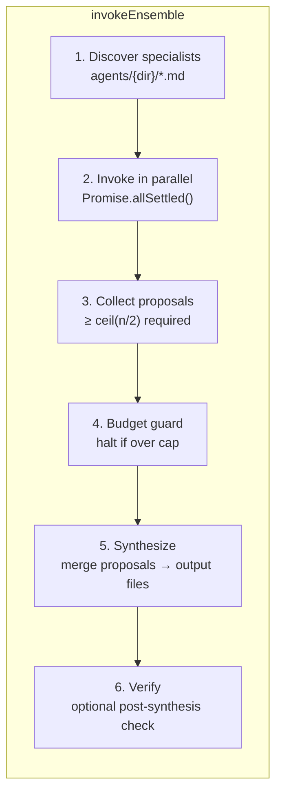
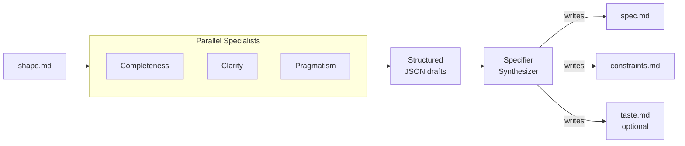
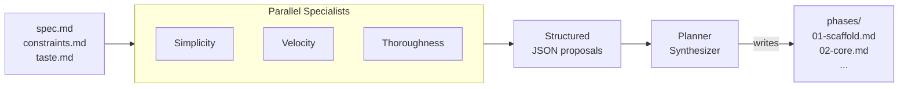
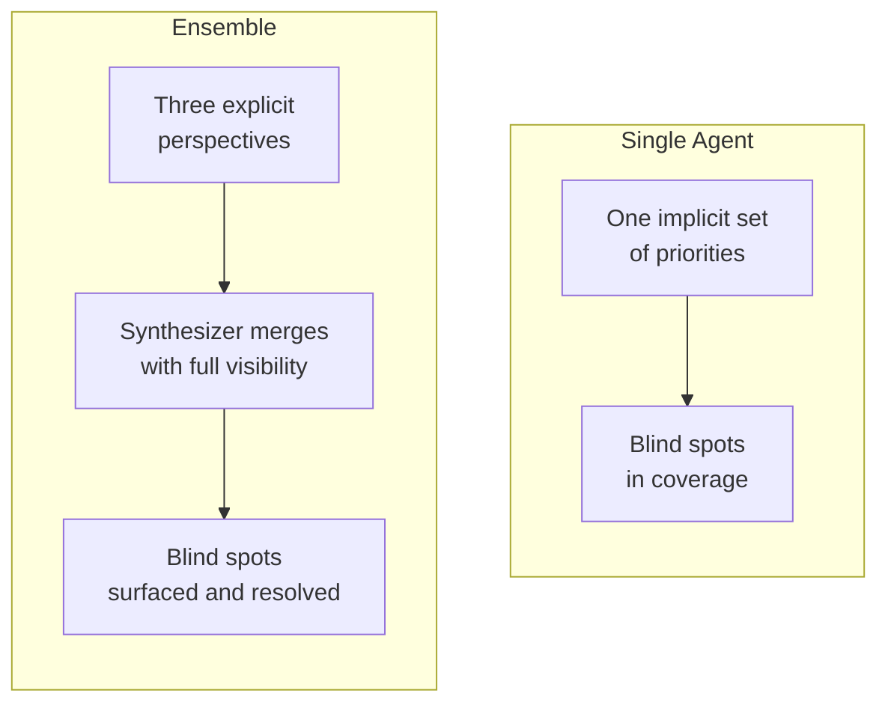
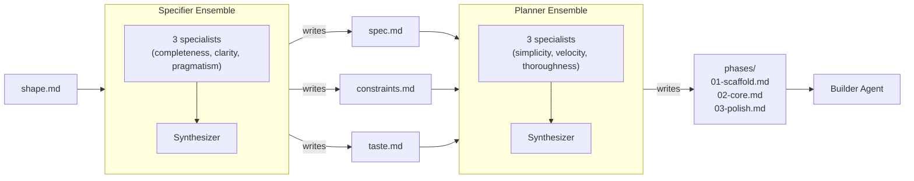

# Ensemble Flows

Ridgeline uses an ensemble pattern at two critical decision points in the
pipeline: **specifying** (turning a shape into a spec) and **planning**
(turning a spec into phases). Both flows run multiple specialist agents in
parallel, each bringing a different perspective, then merge their proposals
through a synthesizer agent. The underlying engine is identical -- a generic
`invokeEnsemble<TDraft>` function parameterized by draft type, agent
directory, and prompt construction.

This document explains the shared ensemble engine, the two flows built on it,
and why the pattern improves output quality.

## The Ensemble Engine

Both the specifier and planner pipelines are thin wrappers around a single
generic ensemble runner. The runner handles all the mechanics -- discovery,
parallel invocation, threshold checks, budget guards, synthesis, and
verification -- so the individual pipelines only need to supply prompts,
schemas, and domain-specific configuration.



### Stage 1: Specialist Discovery

The engine scans `agents/{dir}/` for markdown files with frontmatter
containing a `perspective` field. Each file defines a specialist personality --
a prompt overlay that shapes how it approaches the problem. Excluded files
(like `context.md` for planners) are filtered out. Adding or removing a
specialist is a matter of adding or deleting a `.md` file -- no code changes.

### Stage 2: Parallel Invocation

All specialists run concurrently. Each receives:

- A **system prompt** built from the specialist's overlay
- A **user prompt** containing the input documents
- A **JSON schema** enforcing structured output
- **No tools** -- specialists reason from inputs alone and return JSON

Parallelism means wall-clock time is bounded by the slowest specialist, not
the sum of all.

### Stage 3: Proposal Collection

Results are collected via `Promise.allSettled()`. The engine requires at least
`ceil(n / 2)` successful proposals to proceed:

| Specialists | Minimum required |
|-------------|-----------------|
| 2           | 1               |
| 3           | 2               |
| 4           | 2               |
| 5           | 3               |

Failed specialists (timeouts, parse errors) are logged but do not block the
run. The threshold adapts automatically as specialists are added or removed.

### Stage 4: Budget Guard

If the combined specialist cost already meets or exceeds `--max-budget-usd`,
the engine halts before invoking the synthesizer. This prevents a wasted
synthesis call when the build cannot continue.

### Stage 5: Synthesis

The synthesizer agent receives all successful proposals alongside the original
inputs. Unlike specialists, it has the **Write** tool and produces the final
output files. It applies judgment-based merging -- reading the rationale behind
each proposal and making contextual decisions -- rather than mechanical voting
or averaging.

### Stage 6: Verification

An optional callback runs after synthesis to confirm the expected files were
created. If verification fails, the ensemble throws, surfacing the problem
immediately.

### Cost and Duration

```text
wall-clock = max(specialist durations) + synthesizer duration
total cost = sum(all specialist costs) + synthesizer cost
```

Budget tracking records each role as a separate entry with labels, so cost
attribution is transparent down to individual specialists.

---

## Specifier Ensemble

The specifier ensemble turns a rough `shape.md` into a precise `spec.md`,
`constraints.md`, and optionally `taste.md`. It runs as part of the
`ridgeline spec` command.



### Specialist Perspectives

| Specialist | Focus | Tendency |
|------------|-------|----------|
| **Completeness** | Nothing missing | Covers edge cases, error states, validation, security surfaces. Fills gaps with reasonable defaults. Errs on including too much. |
| **Clarity** | Nothing ambiguous | Converts vague language to concrete, testable criteria. "Fast responses" becomes "under 200ms at p95". Every acceptance criterion should be mechanically verifiable. |
| **Pragmatism** | Everything buildable | Flags underspecified or unrealistically ambitious features. Suggests proven technical defaults. Proposes scope cuts when needed. |

### What Specialists Produce

Each specialist returns a structured JSON draft containing:

- **spec** -- title, overview, features with acceptance criteria, scope boundaries
- **constraints** -- language, runtime, framework, directory/naming conventions,
  dependencies, check command
- **taste** -- code style, test patterns, commit format (or null if shape has no
  style preferences)
- **tradeoffs** -- what the approach sacrifices
- **concerns** -- things the other specialists might miss

### Synthesis Strategy

The specifier synthesizer applies five steps:

1. **Identify consensus** -- where all three specialists agree, adopt directly
2. **Resolve conflicts** -- balance completeness vs pragmatism based on declared
   scope size
3. **Incorporate unique insights** -- include single-specialist concerns that
   address genuine risks
4. **Sharpen language** -- apply the clarity specialist's precision throughout
5. **Respect the shape** -- do not add or remove features beyond declared scope

A critical rule: the spec describes **what**, never **how**. "The API validates
input" is a spec concern. "Use Zod for input validation" is a constraint.

### Verification

After synthesis, the engine confirms that `spec.md` and `constraints.md` exist
in the build directory. If either is missing, the run fails immediately.

---

## Planner Ensemble

The planner ensemble decomposes a spec into sequential build phases. It runs
as part of the `ridgeline plan` command.



### Specialist Perspectives

| Specialist | Focus | Tendency |
|------------|-------|----------|
| **Simplicity** | Fewest phases, most pragmatic boundaries | Combines aggressively. Every phase must justify its existence through a concrete technical dependency. Avoids "organizational tidiness" phases. |
| **Velocity** | Fastest time to working product | Front-loads visible, high-value features. Phase 1 should produce something interactive. Defers polish and optimization. Progressive enhancement. |
| **Thoroughness** | Comprehensive coverage from the start | Edge cases, validation, security, observability. Scopes to the wider interpretation of ambiguity. Better to propose phases the synthesizer trims than to miss concerns. |

### What Specialists Produce

Each specialist returns a structured JSON proposal:

```json
{
  "perspective": "simplicity",
  "summary": "Three-phase plan focusing on...",
  "phases": [
    {
      "title": "Project Scaffold",
      "slug": "project-scaffold",
      "goal": "Establish base project structure...",
      "acceptanceCriteria": ["...", "..."],
      "specReference": "Sections 1-2 of spec.md",
      "rationale": "Groups all foundational work..."
    }
  ],
  "tradeoffs": "Defers edge-case handling to..."
}

### Shared Context

Planner specialists share a `context.md` document that provides common
grounding -- the rules of phase decomposition, sizing guidelines, and output
expectations. This shared context is prepended to each specialist's system
prompt alongside their personality overlay.

### Synthesis Strategy

The planner synthesizer applies the same five-step judgment process:

1. **Identify consensus** -- phases all specialists agree on are strong candidates
2. **Resolve conflicts** -- balance completeness with pragmatism, consider each
   rationale
3. **Incorporate unique insights** -- surface what any single viewpoint would miss
4. **Trim excess** -- remove marginal-value phases
5. **Respect phase sizing** -- target ~50% of the builder model's context window,
   leaving headroom for codebase exploration and tool use

### Verification

After synthesis, the engine scans the phases directory and fails if no phase
files were created.

---

## How Ensembles Improve Quality

### Perspective Diversity

No single agent holds all viewpoints. A simplicity-focused agent will not
think about edge cases. A thoroughness-focused agent will not think about time
to first demo. A velocity-focused agent will not think about long-term
robustness. The ensemble ensures all lenses are applied.



### Structured Disagreement as Signal

When specialists disagree on boundaries, scope, or sequencing, the
disagreement itself is informative. It highlights genuine tension in the
requirements -- places where the right answer depends on priorities that are
not explicitly stated.

**Example**: a spec for a web app with user input forms.

- **Simplicity** folds validation into the form phase -- it is all one feature,
  separating them creates an unnecessary context transition.
- **Thoroughness** proposes a dedicated validation phase covering edge cases,
  error messages, and injection prevention.
- The **synthesizer** sees both rationales. If the spec involves straightforward
  field checks, simplicity is right. If it involves cross-field rules, async
  validation, and security hardening, thoroughness is right. The synthesizer
  makes the call based on actual complexity -- a judgment a single agent would
  have made implicitly and possibly incorrectly.

### Judgment, Not Voting

The ensemble explicitly rejects majority voting or weighted scoring. The
synthesizer reads the rationale behind each proposal and decides in context.
A concern raised by only one specialist can override consensus from the other
two if the reasoning is compelling -- a security risk from the thoroughness
planner, for example, should not be dismissed because simplicity and velocity
did not mention it.

The value is not in averaging perspectives. It is in ensuring nothing important
is missed.

### Graceful Degradation

The 50% success threshold means transient failures do not block the pipeline.
If one specialist times out or returns unparseable output, the ensemble
continues with the remaining proposals. This resilience is automatic -- no
retry logic, no manual intervention.

---

## End-to-End Flow

The two ensembles sit at adjacent stages of the pipeline. Together they
transform a rough idea into a fully decomposed build plan:



Each ensemble costs four Claude calls (three specialists + one synthesizer)
instead of one. The tradeoff is worth it because both stages make
high-leverage decisions: the specifier defines **what** gets built, and the
planner defines **in what order**. Errors at either stage cascade through the
entire build. Investing in quality at these decision points pays for itself
many times over in avoided rework downstream.

---

## Extensibility

Both ensembles are designed to be extended without code changes:

- **New specialists**: drop a `.md` file in `src/agents/specifiers/` or
  `src/agents/planners/` with `name`, `description`, and `perspective`
  frontmatter. The engine discovers it automatically on the next run.

- **Different synthesis strategies**: edit `src/agents/core/specifier.md` or
  `src/agents/core/planner.md` to change how proposals are merged -- weight
  certain perspectives, apply domain heuristics, or adjust sizing targets.

- **New ensemble pipelines**: the generic `invokeEnsemble<TDraft>` function
  can be reused for any future pipeline stage that benefits from multi-
  perspective reasoning. Supply a config object and a draft type, and the
  engine handles the rest.
