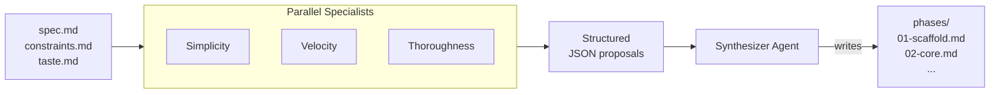

# Ensemble Planning

## The Problem with Single-Perspective Planning

A single planner agent produces a single decomposition of a spec into phases.
That decomposition reflects one implicit set of priorities -- maybe it optimizes
for fewest phases, maybe for fastest time to a working product, maybe for
comprehensive coverage. But any single perspective has blind spots. A planner
optimizing for speed may skip edge cases that matter. A planner optimizing for
thoroughness may propose unnecessary phases that waste context transitions and
budget.

The issue is not that any one perspective is wrong. It is that they are
incomplete. Phase boundaries are judgment calls, and judgment benefits from
multiple viewpoints.

## How It Works

Ridgeline's planner is not a single agent. It is an ensemble: multiple
specialist planners with different perspectives propose plans independently,
then a synthesizer agent merges their proposals into a single coherent phase
plan.

The process has four stages:



### Stage 1: Specialist Discovery

The harness scans `src/agents/planners/` for markdown files with frontmatter.
Each file defines a specialist personality -- a name, a perspective label, and a
short prompt overlay that shapes how it approaches decomposition. The
`synthesizer.md` file is excluded from this scan; it has a separate role.

The current specialists:

| Specialist | Perspective | Tendency |
|------------|-------------|----------|
| **Simplicity** | Fewest phases, most pragmatic boundaries | Combines aggressively. Every phase must justify its existence through a concrete technical dependency. |
| **Velocity** | Fastest time to working product | Front-loads visible value. Phase 1 should produce something a user can interact with. Progressive enhancement. |
| **Thoroughness** | Comprehensive coverage from the start | Edge cases, validation, security, observability. Scopes phases to cover the wider interpretation of ambiguity. |

Adding a new specialist is a matter of dropping a new `.md` file in the
planners directory with the right frontmatter (`name`, `description`,
`perspective`) and a body describing the planning personality. No code changes
required.

### Stage 2: Parallel Specialist Invocation

All specialists run concurrently via `Promise.allSettled()`. Each receives:

- **System prompt**: the base planner prompt (from `agents/core/planner.md`)
  with the specialist's personality overlay prepended and file-writing
  instructions replaced by a JSON output directive.
- **User prompt**: the full spec, constraints, and taste documents.
- **JSON schema**: a structured output schema enforcing the proposal format.
- **No tools**: specialists cannot read files, run commands, or write output.
  They reason from the spec alone and return structured JSON.

Each specialist produces a proposal:

```json
{
  "perspective": "simplicity",
  "summary": "Three-phase plan focusing on...",
  "phases": [
    {
      "title": "Project Scaffold",
      "slug": "project-scaffold",
      "goal": "Establish base project structure...",
      "acceptanceCriteria": ["...", "..."],
      "specReference": "Sections 1-2 of spec.md",
      "rationale": "Groups all foundational work..."
    }
  ],
  "tradeoffs": "Defers edge-case handling to..."
}
```

Specialists have no knowledge of each other. They see the same inputs and
produce independent plans. The diversity comes from their personality overlays,
not from different information.

### Stage 3: Proposal Collection

The harness collects results from all specialists. It requires at least 50% to
succeed (rounded up) -- so with three specialists, at least two must return
valid proposals. If a specialist fails (timeout, parse error, authentication
issue), the harness continues with the remaining proposals rather than aborting.

This graceful degradation means a transient failure in one specialist does not
block planning. The synthesizer works with whatever perspectives are available.

A budget guard runs here: if the combined specialist cost already exceeds
`--max-budget-usd`, planning halts before invoking the synthesizer.

### Stage 4: Synthesis

A dedicated synthesizer agent receives all successful proposals along with the
original spec inputs. Unlike the specialists, the synthesizer has the Write
tool -- its job is to produce the final phase files.

The synthesizer's decision process:

1. **Identify consensus.** Phases that all specialists agree on -- even if named
   or scoped differently -- are strong candidates. Consensus signals a natural
   boundary in the work.

2. **Resolve conflicts.** When specialists disagree on phase boundaries, scope,
   or sequencing, the synthesizer balances completeness with pragmatism, drawing
   on the rationale each specialist provides.

3. **Incorporate unique insights.** If one specialist identifies a concern the
   others missed -- an edge case, a dependency risk, a sequencing insight -- it
   gets included. The value of multiple perspectives is surfacing what any
   single viewpoint would miss.

4. **Trim excess.** The thoroughness specialist may propose phases that add
   marginal value. The simplicity specialist may over-combine things that are
   better separated. The synthesizer finds the right balance.

5. **Respect phase sizing.** Each phase targets roughly 50% of the builder
   model's context window, leaving headroom for codebase exploration, tool use,
   and reasoning.

The synthesis is judgment-based, not mechanical. There is no majority vote or
weighted scoring. The synthesizer reads the rationale behind each proposal and
makes decisions in context. A concern raised by only one specialist can override
consensus from the other two if the rationale is compelling -- a security risk
identified by the thoroughness planner, for example, should not be dismissed
because simplicity and velocity did not mention it. The value of multiple
perspectives is not in averaging them but in ensuring nothing important is missed.

The synthesizer writes numbered phase files (`01-scaffold.md`, `02-core.md`,
etc.) directly to the build's `phases/` directory. It produces nothing else --
no summaries, no commentary, no index file.

## Why an Ensemble

The ensemble approach costs more than a single planner invocation. Three
specialists plus a synthesizer means four Claude calls instead of one. The
tradeoff is worth it for three reasons:

**Better phase boundaries.** Phase boundaries are the highest-leverage decisions
in a build. A bad decomposition -- phases that are too large, too small, poorly
ordered, or missing critical concerns -- cascades through the entire build. Each
subsequent phase inherits the problems. Getting decomposition right on the first
pass saves far more than the extra planning cost.

**Surfacing blind spots.** A simplicity planner will not think about edge cases.
A thoroughness planner will not think about time to first demo. A velocity
planner will not think about long-term robustness. The ensemble ensures that
all three lenses are applied and that the synthesizer can draw from each.

**Structured disagreement.** When specialists disagree about phase boundaries,
the disagreement itself is informative. It highlights genuine tension in the
spec -- places where the right decomposition depends on priorities that are not
explicit. The synthesizer resolves these tensions deliberately rather than
having them resolved implicitly by a single agent's biases.

Consider a spec for a web application with user input forms. The simplicity
planner might fold input validation into the same phase as form implementation --
it is all one feature, and separating them creates an unnecessary context
transition. The thoroughness planner might propose a dedicated validation phase
covering edge cases, error messages, and security concerns like injection
prevention. Neither is wrong. The disagreement reveals a real question: how
complex is the validation? If it is straightforward field-level checks, simplicity
is right. If it involves cross-field rules, async validation against external
services, and security hardening, thoroughness is right. The synthesizer sees both
rationales and makes the call based on the spec's actual complexity -- a judgment
that a single planner would have made implicitly and possibly incorrectly.

## Extensibility

The ensemble is designed to be extended without code changes:

- **New specialists**: add a `.md` file to `src/agents/planners/` with
  `name`, `description`, and `perspective` frontmatter. The harness discovers
  it automatically on the next planning run.

- **Different models**: the synthesizer runs on the model configured via
  `--model` (defaulting to opus). Specialists use the same model. Model
  selection applies uniformly.

- **Custom synthesizers**: the `synthesizer.md` prompt can be edited to change
  how proposals are merged -- weighting certain perspectives more heavily,
  applying domain-specific heuristics, or adjusting phase sizing targets.

The 50% success threshold adapts automatically to the number of specialists. Two
specialists require both to succeed. Five specialists require three. This keeps
the system functional as perspectives are added or removed.

## Cost Profile

A typical planning run with three specialists:

| Role | Invocations | Parallelism | Notes |
|------|-------------|-------------|-------|
| Specialists | 3 | All parallel | No tools, JSON output only |
| Synthesizer | 1 | Sequential (after specialists) | Write tool, produces phase files |

Wall-clock time is dominated by the slowest specialist (since they run in
parallel) plus the synthesizer. Total cost is the sum of all four invocations.
Budget tracking in `budget.json` records each specialist and the synthesizer as
separate entries with role labels, so cost attribution is transparent.

The budget guard between stages 3 and 4 prevents the synthesizer from running if
specialists have already exhausted the budget -- avoiding a wasted invocation
when the build cannot proceed.
