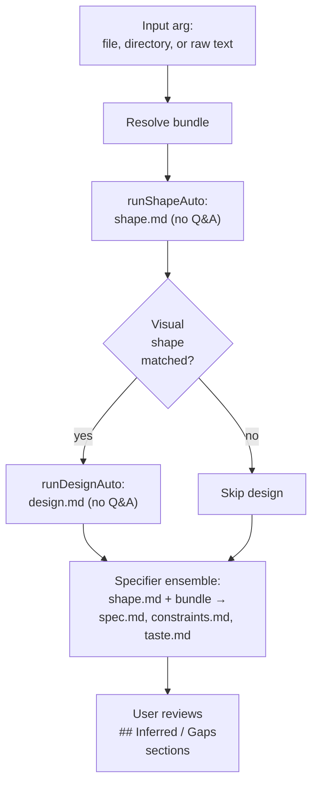

# Ingest

`ridgeline ingest` is a one-shot, non-interactive pipeline kickoff. It
takes an existing PRD, RFC, design doc, or directory of related markdown
files and produces the four ridgeline input files (`shape.md`, `spec.md`,
`constraints.md`, `taste.md`, plus `design.md` when the shape is visual)
in a single run with no Q&A.

The use case is: "I already wrote the spec elsewhere; bootstrap a build
from it." Q&A would just re-collect what the source doc already says.

```text
existing PRD/RFC/dir → ridgeline ingest → shape.md + spec.md + constraints.md + taste.md
                                        ↓
                                       (run ridgeline plan / build from here)
```

## When to Use Ingest

- **Migrating an existing spec.** You wrote a PRD in Notion, exported it,
  and want to feed it into ridgeline without re-answering questions you
  already answered.
- **Folder of related docs.** A `docs/` directory of RFC, design notes,
  and constraints — ingest concatenates them with provenance headers and
  treats the whole bundle as authoritative.
- **CI / automation.** Anywhere Q&A is impractical because there's no
  human at the prompt.

## When Not to Use Ingest

- **You're starting from a description, not a doc.** Run `ridgeline shape`
  or default `ridgeline <name> "<description>"` so the shaper can ask
  clarifying questions.
- **You expect significant scope drift.** Q&A surfaces things the source
  doc didn't anticipate. Ingest preserves the source verbatim and flags
  inferred details rather than asking about them.
- **Your visual surface needs design exploration.** Ingest auto-runs the
  one-shot designer when the shape is visual, but it skips reference
  selection and direction-advisor. Run `ridgeline design` and
  `ridgeline directions` separately if visual exploration matters.

## What Ingest Does



The flow:

1. **Resolve the input bundle.** A single file, a directory of related
   files, or raw text. Directories get their `.md`/`.markdown`/`.txt`/`.rst`
   files concatenated with `## File: <relpath>` provenance headers.
   Standard skip dirs (`node_modules`, `.git`, `.ridgeline`,
   `.worktrees`, `dist`, `build`, `coverage`) are excluded.

2. **Shape (one-shot).** The shaper runs without Q&A, treating the bundle
   as authoritative source material. It still classifies the shape
   (web-visual, game-visual, print-layout, or none) so downstream stages
   know whether to involve design.

3. **Design (one-shot, when visual).** When `shape.md` matches a visual
   category, the designer runs without Q&A and writes `design.md` from
   what the source doc says (or what can be inferred from it). The
   reference-finder is **skipped** — anchor selection needs user
   judgment.

4. **Specifier ensemble.** The standard 3-specialist (or `--specialists 1|2`)
   ensemble runs over `shape.md` plus the original bundle as authoritative
   spec guidance. Specialists draft, the synthesizer merges into
   `spec.md`, `constraints.md`, and `taste.md`.

5. **Gap flagging.** The synthesizer is instructed to add a
   `## Inferred / Gaps` section to each output file listing facts it
   inferred (rather than read from the source) and questions a human
   should answer before plan. This is the seam where ingest hands back
   to the user.

## The `## Inferred / Gaps` Convention

Every file ingest writes ends with a section like:

```markdown
## Inferred / Gaps

**Inferred:**
- The check command is `npm test`. Source mentions tests but doesn't name
  the runner. Confirm or override.
- Performance target of "under 200ms p95" inferred from "should feel
  fast." Source did not specify.

**Open questions:**
- Should rate limiting be in scope for v1, or deferred?
- The source mentions "internal users only" — does that mean auth is
  unnecessary, or that auth is required but tied to an existing identity
  provider?
```

The expectation is that you read each file, edit the Inferred items that
are wrong, answer the Open questions inline (replacing them with concrete
spec text), and run `ridgeline plan <name>` once you're satisfied. The
plan stage will not re-flag these — once the section is gone, they're
treated as resolved.

## Example: Single-File Ingest

```sh
ridgeline ingest task-api ./docs/PRD.md
```

Output:

```text
Build: task-api
Source: /repo/docs/PRD.md

[shape] Generating shape.md from PRD...
[design] Visual shape matched (web-visual); generating design.md...
[spec] Running specifier ensemble (3 specialists)...
[spec] Synthesizer merging proposals with gap flagging on...

Ingest complete for task-api.
Review the generated files in .ridgeline/builds/task-api/ (especially
the "Inferred / Gaps" sections), then run: ridgeline plan task-api
```

## Example: Directory-Bundle Ingest

```sh
ridgeline ingest task-api ./docs/
```

The bundle resolver walks `./docs/` recursively, picks up `.md`,
`.markdown`, `.txt`, and `.rst` files, and concatenates them with
provenance headers:

```markdown
## File: PRD.md

[contents of PRD.md]

## File: rfcs/auth.md

[contents of rfcs/auth.md]

## File: design-notes/api-shape.md

[contents of design-notes/api-shape.md]
```

The synthesizer reads the concatenated bundle as one document but
preserves source attribution in the `## Inferred / Gaps` sections — each
inference cites which file it came from when known.

## Cost

A typical single-file ingest of a ~10k word PRD costs around $3-8 with
opus and the default 3-specialist ensemble:

- Shape one-shot: ~$0.50-$1
- Design one-shot (visual builds only): ~$0.50-$1
- Specifier ensemble (3 specialists + synthesizer): ~$2-6

Drop to `--specialists 1` for a faster, cheaper pass when the source doc
is clear and you don't need the cross-perspective check.

## Comparing Ingest, Shape, and the Spec-to-Ridgeline Skill

Three paths convert source material into ridgeline files:

| Path | When | Q&A | Cost |
|------|------|-----|------|
| `ridgeline shape <name> [input]` | Starting from a description or doc, want clarifying questions | Yes | Cheaper for short inputs |
| `ridgeline ingest <name> <path>` | Starting from a doc/dir, no Q&A wanted, autonomous | No | Higher (full ensemble) |
| `spec-to-ridgeline` skill | Chat-driven extraction from a doc | Conversational | Per-message, depends on doc |

The `spec-to-ridgeline` skill (in `.claude/skills/`) is the chat-driven
counterpart to `ingest` — same conversion logic, different driver.

## CLI Reference

### `ridgeline ingest [build-name] [input]`

| Flag | Default | Description |
|------|---------|-------------|
| `--model <name>` | from settings, else `opus` | Model for shaper, designer, specifier |
| `--timeout <minutes>` | `10` | Max duration per turn |
| `--max-budget-usd <n>` | none | Halt if cumulative cost exceeds this |
| `--specialists <n>` | `3` | Number of specialists (1, 2, or 3) |

```sh
ridgeline ingest my-feature ./PRD.md
ridgeline ingest my-feature ./docs/
ridgeline ingest my-feature ./PRD.md --specialists 1   # cheaper, faster
```

The `input` argument is required. Raw text can be passed but is rare for
ingest — the use case is migrating an existing spec, which lives on disk.

## Related Docs

- [Shaping](shaping.md) — the interactive counterpart, when you want Q&A.
- [Spec-Driven Development](spec-driven-development.md) — what the four
  output files are and why ingest produces all of them.
- [Build Lifecycle](build-lifecycle.md) — what to do after `ingest`
  finishes (review, then `plan`).
