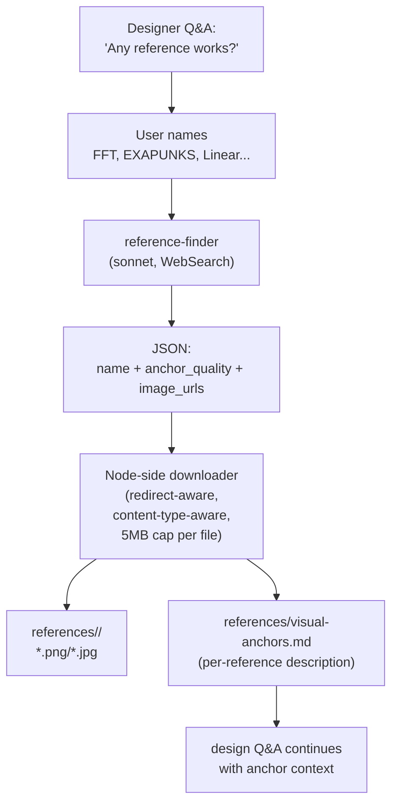

# References and Anchors

When users describe what they want their design to "feel like," they often
name existing works — *Final Fantasy Tactics*, *EXAPUNKS*, the Linear app,
the Stripe dashboard. References anchors the visual conversation in real
imagery rather than abstract adjectives. The reference-finder specialist
turns named references into a local `references/` directory of canonical
images plus a `visual-anchors.md` that downstream agents read.

This page covers the workflow, the file layout, and how anchors influence
direction generation, design Q&A, and visual review.

## Why References Exist

Words like "minimal," "warm," "data-dense," "playful" mean different
things to different people. A user saying "I want it to feel like *Final
Fantasy Tactics*" carries far more signal than the same user saying "warm
and parchment-y" — the former resolves to specific palette choices,
typography, and spatial composition; the latter doesn't.

Without anchors, the visual-reviewer scores `taste_fidelity` against
`design.md` alone. With anchors, it scores against `design.md` *plus*
canonical imagery, which catches subtle drift — the right colors but
wrong proportions, the right palette but wrong typography weight.

## The Workflow

References are gathered during interactive `ridgeline design`. The
designer agent asks the user to name reference works when the question
applies; the harness then dispatches the reference-finder, downloads the
returned URLs, and writes `visual-anchors.md`:



Reference selection runs only in **interactive** `ridgeline design`. The
non-interactive path (`ridgeline ingest`) skips it — anchor selection
needs user judgment that the one-shot ingest deliberately avoids.

## What the Reference-Finder Produces

The agent has `WebSearch` only. For each named reference it picks 2-3
canonical image URLs and writes a one-paragraph anchor description that
is **project-specific**, not a generic recap of the reference:

```json
{
  "references": [
    {
      "name": "Final Fantasy Tactics",
      "anchor_quality": "Parchment-and-sepia palette with stamped corner detailing. Warm, lived-in. Anchors taste fidelity for the project's primary surface treatment.",
      "image_urls": [
        "https://example.com/fft-screenshot-1.png",
        "https://example.com/fft-art-2.jpg"
      ]
    },
    {
      "name": "EXAPUNKS",
      "anchor_quality": "Terminal restraint and information density. Monochrome with one accent. Anchors information hierarchy and the project's anti-decoration posture.",
      "image_urls": ["https://example.com/exapunks-1.png"]
    }
  ]
}
```

The `anchor_quality` paragraph names the *role* the reference plays —
palette? typography? spatial composition? motion? — rather than describing
the reference itself.

The agent skips references where it found nothing usable (rather than
padding with weak hits) and skips references that are too generic to find
("modern minimalism" → not findable; recorded as zero URLs with a stderr
note).

## File Layout

```text
.ridgeline/builds/<build-name>/
└── references/
    ├── final-fantasy-tactics/
    │   ├── 01.png
    │   └── 02.jpg
    ├── exapunks/
    │   └── 01.png
    ├── linear-app/
    │   ├── 01.png
    │   └── 02.png
    └── visual-anchors.md
```

- Each named reference gets a slug-named subdirectory (`Final Fantasy Tactics`
  → `final-fantasy-tactics/`).
- Files are saved with extensions inferred from URL path or
  `Content-Type`. Failed downloads are logged but don't fail the build.
- `visual-anchors.md` lists every reference with its `anchor_quality`
  paragraph, the local file paths, and any failure reasons.

The downloader (`src/references/download.ts`) is a small Node-side fetcher
with redirect handling, content-type-aware extension inference, a 15s
per-file timeout, and a 5MB-per-file cap.

## How Anchors Influence Downstream Stages

Three stages read `visual-anchors.md` when present:

**Direction-advisor** (`ridgeline directions`). When anchors exist, at
least one of the generated directions is required to draw clearly from
them. Other directions still come from contrasting visual schools so the
user has a meaningful choice between "the reference school" and a
deliberate counter-direction.

**Designer** (`ridgeline design`). The designer reads the per-reference
`anchor_quality` paragraphs and uses them as `suggestedAnswer` defaults —
for example, if an anchor describes the project's palette, the designer
proposes hex codes consistent with the anchor. The designer never proposes
new references; they're already resolved.

**Visual-reviewer** (during `ridgeline build`). The visual-reviewer reads
`visual-anchors.md` *and* the image files when scoring `taste_fidelity`.
Without the references directory, it falls back to design.md alone and
appends a confidence caveat:
`"scoring without reference anchors — taste fidelity score has higher variance"`.

## Authoring Anchors by Hand

`visual-anchors.md` is plain markdown. You can write it by hand instead of
running interactive design. The required structure is one entry per
reference:

```markdown
# Visual Anchors

## Final Fantasy Tactics

**Anchor quality:** Parchment-and-sepia palette with stamped corner
detailing. Warm, lived-in. Anchors taste fidelity for the project's
primary surface treatment.

**Files:**
- references/final-fantasy-tactics/01.png
- references/final-fantasy-tactics/02.jpg

## EXAPUNKS

**Anchor quality:** Terminal restraint and information density. Monochrome
with one accent. Anchors information hierarchy and the project's
anti-decoration posture.

**Files:**
- references/exapunks/01.png
```

If you write `visual-anchors.md` by hand, drop the image files into the
matching slug subdirectory yourself. The designer and visual-reviewer
read whichever files are present.

## Re-Running

When `references/visual-anchors.md` already exists, the designer skips
the "name your references" prompt and uses the existing file as Q&A
context. To re-source references, delete the directory and re-run
`ridgeline design`:

```sh
rm -rf .ridgeline/builds/my-feature/references
ridgeline design my-feature
```

## Cost and Model

Reference-finder is a single sonnet call with WebSearch only. Typical
cost is $0.10-$0.50 per reference depending on how much searching is
needed. The downloader is local and free; only WebSearch tokens are
billable.

## Related Docs

- [Design](design.md) — the Q&A flow that triggers reference gathering.
- [Directions](directions.md) — how anchors shape direction generation.
- [Visual Review](visual-review.md) — how anchors improve `taste_fidelity`
  scoring.
