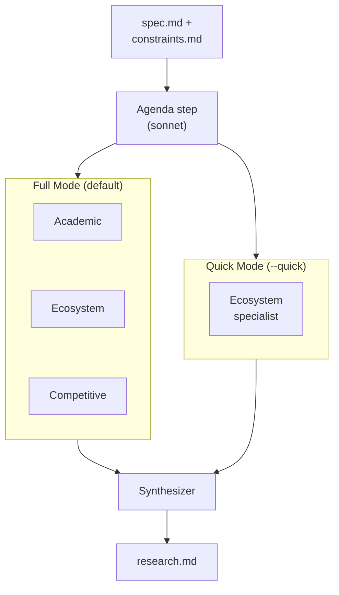
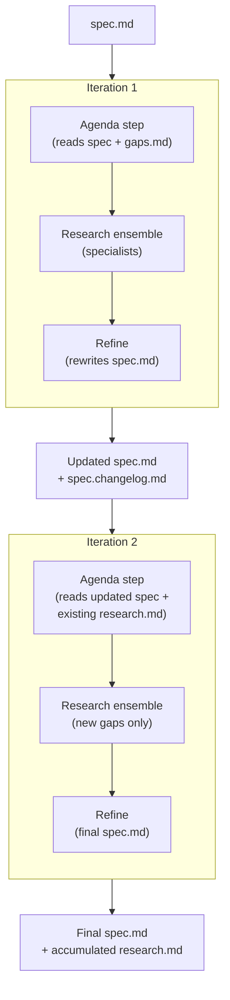

# Research and Refine

Ridgeline's research and refine stages are optional pipeline steps that enrich
a spec with external sources before planning begins. They sit between `spec`
and `plan` in the pipeline:

```text
shape → spec → [research → refine] → plan → build
```

Skipping them goes straight from spec to plan. Auto-advance
(`ridgeline my-feature`) skips them by default -- you opt in explicitly by
running `ridgeline research`.

## Why Research Exists

Specs are only as good as the knowledge behind them. When a spec involves
unfamiliar technology, complex architectural decisions, or libraries that may
have changed since the spec was written, research can surface information that
prevents costly mistakes downstream. A builder that implements a deprecated API
or misses a built-in framework feature wastes phases and budget. Research
catches these problems early -- before planning, not after building.

## Full vs Quick Mode



### Full mode (default)

```sh
ridgeline research my-feature
```

Runs three specialists in parallel plus a synthesizer. Each specialist
investigates through a different lens:

| Specialist | Focus | Where it searches |
|------------|-------|-------------------|
| **Academic** | Novel algorithms, architectures, recent papers | arxiv.org, Semantic Scholar, Google Scholar, conference proceedings |
| **Ecosystem** | Framework docs, library features, version updates | Official docs, release notes, changelogs, GitHub repos, package registries |
| **Competitive** | How other tools solve the same problem | GitHub repos, product pages, developer discussions, Hacker News, Reddit |

Use full mode when the spec domain is unfamiliar, the architecture is complex,
or you want competitive analysis to inform the design.[^1]

### Quick mode

```sh
ridgeline research my-feature --quick
```

Runs one specialist (ecosystem) plus a synthesizer. Fast and focused on the
technologies mentioned in `constraints.md` -- latest docs, recent releases,
migration guides, built-in features you might not know about.

Use quick mode when the tech stack is familiar and you just want a sanity check
against the latest documentation.

### Research agenda pre-step

Before dispatching specialists, the research pipeline runs a lightweight agenda
generation step using sonnet. The agenda step evaluates the current spec against
a domain gap checklist (`gaps.md`) and produces a focused research agenda --
specific questions and search terms for specialists to investigate.

On iteration 2+, the agenda shifts focus to unexplored territory, using the
accumulated findings log and `spec.changelog.md` to avoid repeating prior work.

### gaps.md

Each flavour has a `researchers/gaps.md` file -- a static domain checklist of
common spec gaps (e.g., security considerations, error handling, performance
constraints, accessibility). There is also a base checklist for generic software
projects. The agenda step reads this to know what to look for, ensuring
specialists investigate areas the spec may have missed rather than only
confirming what is already there.

### How specialists work

Research specialists are different from specifier and planner specialists in
one key way: they have tools. Specifier and planner specialists reason from
inputs alone and return structured JSON. Research specialists have access to
`WebFetch`, `WebSearch`, and `Bash`, and they return prose markdown reports
rather than structured data. The ensemble engine handles this via its
`isStructured` flag -- when false, specialists produce free-form text instead
of schema-validated JSON.

Each specialist receives the current `spec.md`, `constraints.md`, and
`taste.md` as context, along with its shared context document
(`agents/researchers/context.md`), its personality overlay, and the research
agenda. It researches the spec using its web tools and returns a markdown
report with sourced findings and recommendations.

The synthesizer (the `researcher` core agent) then merges the specialist
reports into `research.md`, deduplicating findings, resolving conflicts, and
ranking recommendations by impact.[^2]

## Auto Mode

```sh
ridgeline research my-feature --auto        # 2 iterations (default)
ridgeline research my-feature --auto 5      # 5 iterations
ridgeline research my-feature --auto 2          # 2 iterations
```

Auto mode chains research and refine into an iterative loop:



Each iteration generates an agenda, researches the current spec (which includes
improvements from prior iterations), and refines it. This is useful when the
domain is complex enough that a single research pass won't surface everything --
each iteration can dig deeper into areas the previous refine added. The agenda
step ensures later iterations focus on unexplored gaps rather than re-covering
old ground.

The default is 2 iterations when `--auto` is passed without a number. The
number is configurable: `--auto 1` for a single pass, `--auto 5` for thorough
exploration.

After auto mode completes, the user reviews the final `spec.md` and proceeds
to planning.

## The Refine Step

```sh
ridgeline refine my-feature
```

The refiner is a single agent (not an ensemble). It reads `spec.md`,
`research.md`, and `spec.changelog.md` (if it exists), then rewrites `spec.md`
incorporating the research findings.

### spec.changelog.md

The refiner writes `spec.changelog.md` alongside `spec.md` after each
iteration. This changelog documents what changed and why, with source citations
from the research findings. It also includes "Skipped" entries for
recommendations that were not incorporated, along with the reasoning.

Both the researcher and refiner read `spec.changelog.md` on subsequent
iterations to avoid redundant work -- the researcher shifts its agenda away
from already-addressed topics, and the refiner avoids re-evaluating
recommendations that were previously considered and skipped.

### Refinement rules

- **Additive by default.** The refiner adds insights, edge cases, and
  approaches the research uncovered. It does not remove existing spec content
  unless research shows it is wrong or superseded.
- **Preserves structure.** The revised spec keeps the same markdown structure
  and section ordering. New content is added within existing sections or as
  new subsections.
- **Cites sources.** When adding content from research, the refiner includes
  inline notes like "(per [source URL])" so the user knows which changes came
  from research and can verify them.
- **Stays within scope.** Research may suggest new features beyond the spec's
  declared scope. These go into a "Future Considerations" section rather than
  the feature list.
- **Constraints are immutable.** The refiner never modifies `constraints.md`
  or `taste.md`. If research suggests a different framework or language, it
  notes the alternative in the spec as a consideration.
- **Flags conflicts.** When research contradicts an existing spec decision, the
  refiner keeps the original decision but adds a note explaining the
  alternative and trade-offs.

### What the refiner does NOT do

- Rewrite the spec from scratch
- Add implementation details (the spec describes what, not how)
- Remove features the user explicitly specified
- Modify constraints or taste files

## research.md Format

The synthesizer produces `research.md` in the build directory. Findings
accumulate across iterations -- the file is not overwritten each time. The
format:

```markdown
# Research Findings

> Spec: [spec title]

## Active Recommendations

Bullet list of the 3-5 most impactful recommendations, rewritten each
iteration based on all findings to date.

## Findings Log

### Iteration 2 — [date]

#### [Topic/Theme]

**Source:** [URL or citation]
**Perspective:** [which specialist found this]
**Relevance:** [why this matters to the spec]
**Recommendation:** [what should change in the spec]

...

### Iteration 1 — [date]

#### [Topic/Theme]

**Source:** [URL or citation]
**Perspective:** [which specialist found this]
**Relevance:** [why this matters to the spec]
**Recommendation:** [what should change in the spec]

...

## Sources

Cumulative numbered list of all URLs and citations across all iterations.
```

Newest iterations appear first in the Findings Log. Active Recommendations
are rewritten each iteration to reflect the full body of accumulated findings,
not just the latest round. Sources are cumulative -- new sources are appended
each iteration, never removed.

In quick mode (one specialist), the synthesizer still organizes and structures
the findings rather than passing them through unchanged.

## Network Access

Research specialists need web access. When sandboxing is active, Ridgeline
automatically extends the network allowlist with research-specific domains:

- arxiv.org, export.arxiv.org
- api.semanticscholar.org
- scholar.google.com
- docs.python.org, developer.mozilla.org, docs.rs, pkg.go.dev
- learn.microsoft.com, devdocs.io

These are added on top of the project's existing allowlist in
`.ridgeline/settings.json`. In `--unsafe` mode, no network restrictions apply.

## Workflows

### Manual workflow

Run each step separately, reviewing and editing between them:

```sh
ridgeline spec my-feature
ridgeline research my-feature           # produces research.md
# Review and edit research.md -- remove noise, add notes
ridgeline refine my-feature            # rewrites spec.md, writes spec.changelog.md
# Review the updated spec.md and spec.changelog.md
ridgeline plan my-feature
```

The manual workflow gives you full control over what research findings make it
into the spec. You can edit `research.md` before refining -- remove irrelevant
findings, add your own notes, adjust recommendations. The refiner works from
whatever is in `research.md`, so your edits are incorporated.

### Auto workflow

Let research and refine iterate automatically:

```sh
ridgeline spec my-feature
ridgeline research my-feature --auto 2    # 2 iterations of research + refine
# Review the final spec.md and spec.changelog.md
ridgeline plan my-feature
```

The auto workflow is faster and hands-off. Good when you trust the research
process and want to explore the domain broadly before reviewing the result.

## When to Use Research

- **Unfamiliar technology or domain.** Research surfaces gotchas, best
  practices, and recent changes you might not know about.
- **Complex architectural decisions.** Academic and competitive research can
  validate or challenge your approach before you commit to it.
- **Libraries with frequent updates.** Ecosystem research checks the latest
  docs and release notes, catching deprecations and new built-in features.
- **Competitive landscape matters.** If the spec is for a product in a
  crowded space, competitive research reveals what works and what doesn't.

## When to Skip Research

- **Well-understood domain.** If you wrote the spec from deep personal
  knowledge, research is unlikely to add value.
- **Small or simple specs.** A CSV-to-JSON converter does not need academic
  research.
- **Time-constrained builds.** Research adds wall-clock time and cost. Skip
  it when speed matters more than thoroughness.
- **Stable, well-known tech stacks.** If the constraints specify mature
  frameworks with stable APIs, ecosystem research has diminishing returns.

## Cost

Research costs depend on mode and iterations. Each iteration now includes an
agenda step (1 sonnet call):

| Configuration | Claude calls | Approximate cost profile |
|---------------|-------------|--------------------------|
| Full research (default) | 5 (1 agenda + 3 specialists + 1 synthesizer) | Moderate |
| Quick research (`--quick`) | 3 (1 agenda + 1 specialist + 1 synthesizer) | Low |
| Refine | 1 | Low |
| `--auto 2` | 11 (2 x (1 agenda + 3 specialists + 1 synthesizer) + 2 x refine) | Moderate |
| `--auto 2 --quick` | 7 (2 x (1 agenda + 1 specialist + 1 synthesizer) + 2 x refine) | Low-Moderate |

`--auto 2` is the default when `--auto` is passed without a number.

All costs are tracked in `budget.json` with `research` and `refine` role
labels. Use `--max-budget-usd` to cap spending.

## CLI Reference

### `ridgeline research [build-name]`

Research the spec using web sources. Produces `research.md` in the build
directory.

| Flag | Default | Description |
|------|---------|-------------|
| `--model <name>` | `opus` | Model for research agents |
| `--timeout <minutes>` | `15` | Max duration per agent |
| `--max-budget-usd <n>` | none | Halt if cumulative cost exceeds this amount |
| `--quick` | off | Run a single random specialist instead of the full ensemble |
| `--auto [iterations]` | off | Auto-loop: research + refine for N iterations (default 2 if no number given) |
| `--flavour <name-or-path>` | none | Agent flavour: built-in name or path to custom agents |

### `ridgeline refine [build-name]`

Merge research.md findings into spec.md. Requires `research.md` to exist in
the build directory. Writes `spec.changelog.md` alongside `spec.md`.

| Flag | Default | Description |
|------|---------|-------------|
| `--model <name>` | `opus` | Model for refiner agent |
| `--timeout <minutes>` | `10` | Max duration |
| `--flavour <name-or-path>` | none | Agent flavour: built-in name or path to custom agents |

[^1]: **Further reading:** [Triangulation in Research](https://doi.org/10.1177/1558689806298224) — Methodological triangulation -- investigating the same question through multiple independent lenses -- is a well-established technique for reducing bias and improving validity in research.
[^2]: **Further reading:** [Systematic Literature Reviews in Software Engineering](https://doi.org/10.1016/j.infsof.2008.09.009) — Kitchenham and Charters' guidelines on structured synthesis of multi-source research findings, the academic foundation for deduplication-and-ranking approaches to research aggregation.
