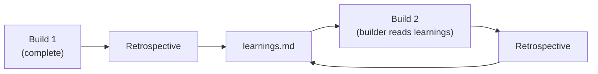

# Retrospective

After a build completes, the retrospective stage analyzes what happened and
extracts learnings for future builds. It reads the build's trajectory,
budget, feedback files, and final state, then appends a structured analysis
to `.ridgeline/learnings.md`.

```text
shape → spec → plan → build → [retrospective]
```

The retrospective is a post-build step, not part of the main pipeline. It
runs after the build finishes (whether it succeeded or failed) and does not
affect pipeline state.

## Why Retrospective Exists

Builds generate a large volume of structured data -- event logs, cost
breakdowns, reviewer verdicts, retry histories. This data is valuable but
hard to interpret by reading the raw files. The retrospective agent
synthesizes it into actionable insights: what worked, what didn't, what
patterns to repeat, what to avoid.

More importantly, the learnings persist. When a `learnings.md` file exists,
future builders automatically receive it as context. This creates a feedback
loop: lessons from past builds inform future builds without manual
intervention.



## What the Retrospective Analyzes

The retrospective agent receives four inputs:

| Input | What it reveals |
|-------|-----------------|
| `trajectory.jsonl` | Chronological event log: plan/build/review/retry events with durations and costs |
| `budget.json` | Per-phase, per-role cost breakdown |
| `state.json` | Final build state: phase statuses, retry counts, timestamps |
| `*.feedback.md` | Reviewer verdicts from any retried phases |

From these, the agent answers:

- Which phases completed cleanly on the first attempt?
- Which phases required retries? What were the reviewer's objections?
- Where was the most time and money spent?
- Were there recurring failure patterns (e.g., the same type of issue across
  multiple phases)?

## What the Retrospective Produces

The agent appends a structured entry to `.ridgeline/learnings.md`. Each entry
follows this format:

```markdown
## Build: my-feature (2026-04-12)

### What Worked
- Phase 01 (scaffold) passed cleanly in 3 minutes — well-scoped with clear criteria
- Constraints file specified exact test command, eliminating reviewer ambiguity

### What Didn't
- Phase 03 (auth) failed twice — spec mentioned "JWT auth" without specifying
  token refresh behavior, causing reviewer to reject incomplete implementation
- Phase 04 took 8 minutes due to overly broad scope (validation + error handling
  + edge cases in one phase)

### Patterns to Repeat
- Keeping phases focused on a single concern (01 and 02 both passed first try)
- Specifying check commands in constraints.md rather than relying on reviewer inference

### Patterns to Avoid
- Combining validation and error handling in the same phase — split them
- Leaving authentication edge cases (refresh, expiry) implicit in the spec

### Cost Analysis
- Total: $4.82 across 6 builder + 8 reviewer invocations
- Phase 03 was most expensive ($1.60) due to two retries
- Quick phases (01, 02) averaged $0.45 each

### Recommendations for Next Build
- Add explicit token lifecycle section to any auth-related spec
- Cap phase scope to ~1 acceptance criterion cluster
- Consider adding a "verify auth flow end-to-end" phase after individual auth phases
```

The agent is instructed to be concrete and specific. "Phase 03 failed because
the spec didn't mention auth middleware" is useful. "Consider being more
specific in specs" is not.

### Accumulation

Learnings accumulate. Each retrospective appends to the file -- previous
entries are never overwritten. Over time, `learnings.md` becomes a project
history of build patterns and anti-patterns.

## How Learnings Feed Back

When `learnings.md` exists at `.ridgeline/learnings.md`, the builder agent
receives it as additional context during build phases. This means:

- A builder working on phase 03 of a new feature might see that a previous
  build's phase 03 failed due to missing auth edge cases, and proactively
  address them.
- Patterns that worked well in past builds (like keeping phases tightly
  scoped) are reinforced through accumulated evidence.

The feedback is passive -- the builder reads the learnings but is not
required to follow them. They serve as institutional memory, not hard
constraints.

## When to Run Retrospective

**After completed builds.** Whether the build succeeded or failed, there are
always learnings to extract. A clean build with zero retries is worth noting
-- it validates the spec and constraint quality.

**After failed builds.** Especially valuable. The retrospective captures why
phases failed and what the reviewer objected to, which directly informs how
to write better specs and constraints next time.

**Periodically for long-running projects.** If you've done several builds,
the accumulated learnings create a useful reference for tuning your spec
writing.

## CLI Reference

### `ridgeline retrospective [build-name]`

Analyze a completed build and extract learnings.

| Flag | Default | Description |
|------|---------|-------------|
| `--model <name>` | `opus` | Model for retrospective agent |
| `--timeout <minutes>` | `10` | Max duration |
| `--flavour <name-or-path>` | none | Agent flavour: built-in name or path to custom agents |

## Cost

The retrospective is a single Claude invocation with read and write access.
It reads build artifacts and appends to `learnings.md`. Typical cost is low
-- comparable to a single refine step.
