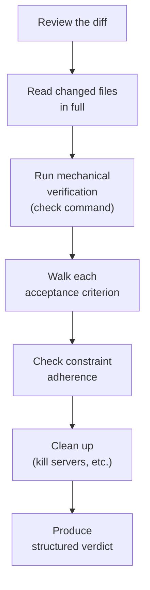
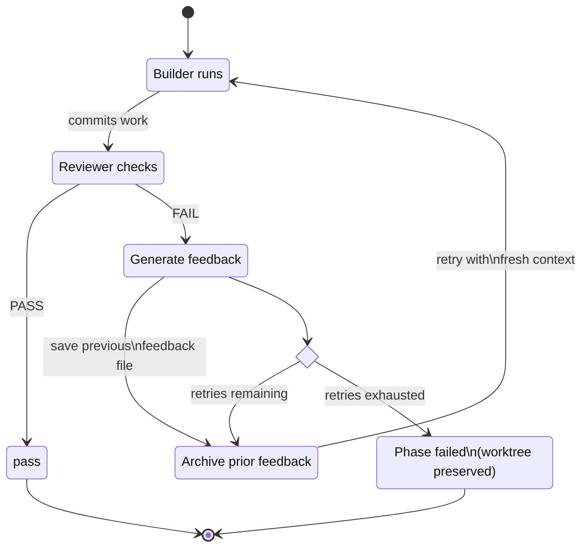

# Review and Feedback

## The Reviewer's Role

The reviewer is an adversarial inspector. Its job is to find problems, not
validate success. The system prompt is explicit: "Assume the builder made
mistakes. Look for them."

The reviewer has read-only access to the project. It can read files, run
commands, search the codebase, and delegate to specialist agents -- but it
cannot modify code. This constraint is structural, enforced by the Claude CLI's
`--allowedTools` flag, not just prompt instruction. The reviewer's only output
is a structured JSON verdict.

This is deliberate. A reviewer that can fix problems is no longer purely a
reviewer -- it becomes a second builder with different priorities. Separating
the roles keeps the feedback loop clean: the reviewer identifies problems, the
builder fixes them.

## What the Reviewer Receives

Each reviewer invocation gets three inputs:

- **Phase spec.** The phase's goal, context, and acceptance criteria. This is
  the primary document -- the reviewer walks each acceptance criterion and
  verifies it is met.
- **Git diff.** The diff from the phase's checkpoint tag to HEAD, showing
  exactly what the builder changed. This scopes the review to the current
  phase's work.
- **Constraints.** The project's `constraints.md` file. Constraint violations
  are failures regardless of whether acceptance criteria pass.

The reviewer does not receive `taste.md`. Taste is best-effort guidance for the
builder -- style preferences that the builder follows when practical but can
deviate from with justification. The reviewer's job is to verify hard criteria,
not police style.

## The Review Process



The reviewer follows a structured sequence:

1. **Review the diff.** Understand the scope of changes -- what files were
   added, modified, deleted.

2. **Read changed files.** Diffs omit context. The reviewer reads full files to
   understand how changes fit into the broader codebase.

3. **Run verification.** If a verifier specialist agent is available, delegate
   to it for running the check command, lint, type-check, and tests. If not,
   run the check command directly. Mechanical verification catches the obvious
   problems.

4. **Run visual review** (visual phases only). When the diff touches visual
   code (`apps/**/*.tsx`, `*.svg`, `*.css`, `tailwind.config.*`, or other
   rendered surfaces) and the sensor findings include screenshot paths, the
   reviewer dispatches the **visual-reviewer** specialist. Visual-reviewer
   scores taste fidelity, motion discipline, information hierarchy,
   convention adherence, and anti-slop on a 0-10 scale and returns
   Keep / Fix / Quick Wins lists. The reviewer composes its critique into
   the verdict per the thresholds in [Visual Review](visual-review.md).

5. **Walk each acceptance criterion.** This is the core of the review. For each
   criterion in the phase spec, the reviewer verifies observable behavior --
   starting servers, hitting endpoints, running specific tests, inspecting file
   contents. Every claim must be backed by evidence: file paths, line numbers,
   command output.

6. **Check constraint adherence.** Verify that the builder's implementation
   matches the language, framework, directory structure, naming conventions,
   and dependency restrictions specified in constraints.md.

7. **Clean up.** Kill all background processes started during review (servers,
   watchers, etc.).

8. **Produce verdict.** The structured JSON verdict is the reviewer's final
   output. Nothing comes after it.

## Structured Verdicts

The reviewer produces a JSON verdict with a defined schema:

```json
{
  "passed": false,
  "summary": "API endpoints work but authentication middleware is missing.",
  "criteriaResults": [
    {
      "criterion": 1,
      "passed": true,
      "notes": "GET /api/tasks returns 200 with JSON array. Verified via curl."
    },
    {
      "criterion": 2,
      "passed": false,
      "notes": "No auth middleware found. Endpoints accept unauthenticated requests."
    }
  ],
  "issues": [
    {
      "criterion": 2,
      "description": "Authentication middleware not implemented. All endpoints are publicly accessible.",
      "file": "src/routes/tasks.ts",
      "severity": "blocking",
      "requiredState": "All /api/ endpoints require a valid JWT in the Authorization header. Unauthenticated requests return 401."
    }
  ],
  "suggestions": [
    {
      "description": "Consider adding rate limiting to public endpoints.",
      "severity": "suggestion"
    }
  ]
}
```

The structure matters:

- **`passed`** is true only when all criteria pass and there are no blocking
  issues. This is the harness's gate signal.
- **`criteriaResults`** provides per-criterion pass/fail with evidence. The
  builder on retry can see exactly which criteria passed and focus on the ones
  that did not.
- **`issues`** are blocking problems. Each includes a `requiredState` field
  describing what the end state should be -- not how to get there, but what
  "fixed" looks like. This gives the builder a clear target without
  prescribing implementation.
- **`suggestions`** are non-blocking improvements. They do not affect the
  pass/fail verdict. The builder can address them if convenient but is not
  required to.

Why structured over prose? Three reasons. First, the harness can parse it
mechanically to decide pass/fail, generate feedback files, and update state.
Second, the builder on retry gets actionable information -- specific criteria,
specific files, specific required states -- rather than a wall of text to
interpret.[^1] Third, the structured format is auditable: the trajectory log records
each verdict, making it possible to trace exactly why a phase passed or failed.

## Required Tools and Required Views

Phase specs may declare two optional sections that drive preflight and
visual review:

**`## Required Tools`** lists tools a phase needs (e.g., `playwright`,
`agent-browser`, an MCP server). Before a declared phase runs, the harness
re-probes the listed tools under the active sandbox. If any tool can't
launch — for example, if the sandbox doesn't expose Chromium and the phase
needs Playwright — the phase aborts with a remediation message before any
budget is spent.

```markdown
## Required Tools

- playwright
- agent-browser
```

**`## Required Views`** lists screenshots the visual-reviewer needs to
score the phase. Each item is a label optionally followed by viewport,
zoom, or URL attributes:

```markdown
## Required Views

- canvas-default: 1280x800, url /
- node-zoomed-in: 1280x800, zoom 2.0, url /flow/hello
- mid-flow: 1280x800, url /flow/hello?demo=mid-flow
```

When `Required Views` is declared, the harness loops the playwright sensor
over each view and persists per-view screenshots under
`<buildDir>/sensors/<phaseId>/`. The visual-reviewer reads each one and
grounds its Fix items in concrete screenshot paths. When the section is
absent, the harness captures a single default screenshot (back-compat); the
visual-reviewer notes lower confidence in its `confidence_caveats`.

The plan-reviewer flags visual phases that omit `Required Views` during
plan synthesis — the default fallback exists, but explicit views produce
stronger reviews.

## Acceptance Criteria as the Only Gate

The reviewer checks outcomes, not approach. It does not care whether the builder
used a factory pattern or a builder pattern, whether the code is elegant or
merely functional, whether the variable names are inspired or mundane. It cares
whether the acceptance criteria are met and the constraints are respected.

This is a deliberate design choice that preserves builder autonomy. The builder
has full creative freedom within the boundaries set by the spec and constraints.
Different builders (or the same builder on different attempts) may produce
different implementations that all satisfy the same criteria. This is acceptable
-- the spec defines what "done" looks like, not what the code looks like.

Constraint violations are the exception to the outcomes-only rule. A constraint
is a hard gate: if the spec says "Framework: Fastify" and the builder uses
Express, that is a failure regardless of whether all acceptance criteria pass.
Constraints define the playing field; acceptance criteria define the goal.

Taste is explicitly excluded from review. If the project's taste.md says
"prefer named exports" and the builder uses default exports, that is not a
review failure. The builder notes the deviation in the handoff, and the next
phase can follow whichever convention has been established. Taste influences;
it does not enforce.

## The Feedback Loop



When a phase fails review, the harness generates a feedback file from the
structured verdict. The process:

1. **Archive prior feedback.** If this is a retry, the previous feedback file is
   saved as `<phase>.feedback.0.md`, `<phase>.feedback.1.md`, etc. This
   preserves the history of what was tried.

2. **Generate current feedback.** The harness writes `<phase>.feedback.md` from
   the verdict: failed criteria with evidence, blocking issues with required
   states, and what already passed (so the builder knows not to break it).

3. **Retry the builder.** The builder gets a fresh context window with the
   same phase spec, constraints, taste, and handoff -- plus the feedback file.
   The feedback targets the builder's attention on what needs fixing rather than
   re-implementing everything from scratch.

The retry is a fresh Claude invocation. The builder does not carry context from
the previous attempt. It reads the feedback, orients on the current codebase
state (which includes whatever the failed attempt left behind), and addresses
the specific issues. This prevents accumulated confusion from compounding
across retries.

Retries are capped at a configurable limit (default: 2, set via
`--max-retries`). If retries are exhausted, the build halts with the phase
marked as failed. The worktree is left intact, and the user receives
instructions for manual recovery: inspect the code, edit the spec or
constraints, and re-run `ridgeline build` to resume.

The cap prevents infinite loops where the builder and reviewer disagree about
how to satisfy a criterion. This can happen when acceptance criteria are
ambiguous or when the criterion requires capabilities the builder does not have.
The right fix is usually in the spec, not in more retries.[^2]

## When Review Breaks Down

The review system has a fundamental dependency: acceptance criteria must be
mechanically verifiable. "GET /api/users returns 200 with a JSON array" is
verifiable -- the reviewer can run curl and check. "The user experience is
intuitive" is not -- the reviewer has no way to measure intuition.

Common failure modes:

**Ambiguous criteria.** "The API handles errors gracefully" -- what counts as
graceful? The reviewer must make a judgment call, which may differ from what the
user intended. The fix: be specific. "Invalid input returns 400 with a JSON
body containing an `error` field."

**Criteria requiring human judgment.** "The UI matches the design mockup" -- the
reviewer cannot compare visual output to an image with reliability. The fix:
decompose visual requirements into verifiable properties. "The header is fixed
at the top of the viewport. The navigation has three links. The primary button
uses the color #2563EB."

**Criteria beyond the model's capability.** Some verification requires domain
expertise or external systems that the reviewer cannot access (e.g., "the
payment integration works with Stripe's test mode"). The fix: use the check
command in constraints to run integration tests that the reviewer can invoke
rather than relying on the reviewer to test the integration directly.

The general principle: when review breaks down, the solution is better criteria,
not a smarter reviewer. The reviewer is a verification engine. Feed it
verifiable inputs and it works well. Feed it ambiguity and it struggles -- just
as any verification system would.[^3]

[^1]: **Further reading:** [Code Review Effectiveness](https://www.microsoft.com/en-us/research/publication/code-reviewing-in-the-trenches-understanding-challenges-best-practices-and-tool-needs/) — Microsoft Research study on code review practices, finding that structured, specific feedback significantly improves defect detection over unstructured prose reviews.
[^2]: **Further reading:** [Expectations, Outcomes, and Challenges of Modern Code Review](https://sback.it/publications/icse2013.pdf) — Bacchelli and Bird's foundational study showing that the primary value of code review is finding defects early, and that clear criteria are the strongest predictor of review effectiveness.
[^3]: **Further reading:** [Modern Code Review: A Case Study at Google](https://research.google/pubs/modern-code-review-a-case-study-at-google/) — Google's analysis of code review at scale, confirming that mechanically verifiable criteria produce more consistent review outcomes than subjective assessments.
