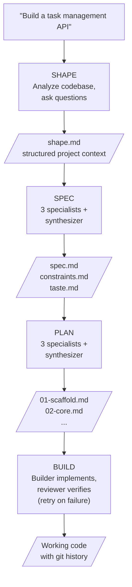

# Shaping: From Idea to Build

You have an idea. Maybe it's a single sentence. Maybe it's a few bullet
points scribbled in a notes app. Maybe it's a requirements doc from a
stakeholder. Ridgeline's job is to take whatever you have and grow it -- step
by step, with your input -- into something precise enough to build
automatically.

This process is called **shaping**, and it's how every ridgeline build starts.

## What Is a Shape?

A shape is a structured document that captures everything ridgeline needs to
know about your project before it starts writing specs, plans, or code. It's
not a spec -- it doesn't describe exactly what to build. It's a map of the
problem: what you're trying to accomplish, how big it is, what already exists,
and what constraints matter to you.

Think of it like the conversation you'd have with a contractor before they
draw up blueprints. You're not designing the building yet. You're describing
what you need, what the site looks like, and what matters most to you.

The shape document covers:

- **Intent** -- what you're building, why, and why now
- **Scope** -- how big the work is, what's included, what's explicitly excluded
- **Solution shape** -- broad strokes of what the deliverable does and who uses it
- **Risks and complexities** -- edge cases, ambiguities, places where scope could creep
- **Existing landscape** -- your codebase, dependencies, data structures, relevant modules
- **Technical preferences** -- error handling, performance targets, security, trade-offs, style

You don't need to know all of this upfront. That's the point of the shaping
process -- ridgeline helps you fill it in.

## Starting with What You Have

Every build starts with the `shape` command. You give it a name and whatever
context you have:

```sh
# A single sentence
ridgeline shape my-api "Build a REST API for task management"

# A longer description
ridgeline shape my-api "Build a REST API for task management with JWT auth,
PostgreSQL backing, Fastify framework, deployed to AWS Lambda"

# An existing document
ridgeline shape my-api ./requirements.md
```

The more you provide upfront, the fewer questions ridgeline needs to ask. But
even a single sentence is enough to get started.

## The Conversation

After you provide your initial input, ridgeline's shaper agent does two
things:

**First, it looks at what already exists.** If you're working in an existing
codebase, the shaper reads your project files -- package.json, config files,
directory structure, existing code patterns. It uses what it finds to pre-fill
answers and frame questions as confirmations rather than open-ended prompts.

For example, if you have Express and TypeScript in your project, the shaper
won't ask "what language and framework do you want?" -- it'll ask "I see
you're using Express with TypeScript. Should this new feature follow the same
stack?"

If you're starting from scratch with no existing code, the shaper asks
open-ended questions instead.

**Second, it asks you clarifying questions.** These come in rounds -- up to
four, with three to five questions each. Each round focuses on a theme:

### Round 1: Intent and Scope

The shaper starts with the big picture. What are you building? Why does it
matter? How big is this work?

> *What problem does this solve, and who is it for?*
>
> *How large is this project -- a quick utility, a full feature, an entire
> system?*
>
> *What must this absolutely deliver? What should it explicitly not do?*

If your initial description was detailed, the shaper may already have
suggested answers for these. You can accept, correct, or replace them.

### Round 2: Solution Shape and Existing Landscape

Now the shaper digs into what the deliverable actually does and how it fits
with what exists.

> *What are the primary workflows? What do users do, and what happens?*
>
> *What are the key entities and how do they relate?*
>
> *What existing code does this touch or extend?*
>
> *Any external services, APIs, or integrations?*

Again, if the shaper found relevant code in your project, it'll suggest
answers based on what it discovered.

### Round 3: Risks and Complexities

The shaper surfaces potential problems early, before they become surprises
during the build.

> *Any known edge cases or tricky scenarios?*
>
> *Where could scope expand unexpectedly?*
>
> *Migration or backward-compatibility concerns?*
>
> *What does "done" look like? How would you verify it?*

### Round 4: Technical Preferences

Finally, the shaper asks about the qualities that matter beyond just working
code.

> *How should the system handle errors? Fail fast? Graceful degradation?*
>
> *Any performance expectations or constraints?*
>
> *Security considerations?*
>
> *Trade-offs -- simplicity vs. configurability? Speed vs. correctness?*

Not every build needs all four rounds. If your initial input was detailed, the
shaper may mark itself ready after one or two rounds. And you can always
accept the suggested answers and move quickly through the process.

## What the Shaper Produces

At the end of the conversation, the shaper writes `shape.md` into your build
directory at `.ridgeline/builds/<your-build-name>/shape.md`. This is the
artifact that feeds the next stage.

Here's a simplified example of what a shape document looks like:

```markdown
# Task Management API

## Intent
Build a REST API that allows users to create, read, update, and delete tasks
with JWT-based authentication. This is a greenfield feature for the platform.

## Scope
Size: medium

**In scope:**
- Task CRUD operations
- User authentication via JWT
- Input validation and structured error responses

**Out of scope:**
- Real-time updates via websockets
- Role-based access control
- Mobile client

## Solution Shape
A REST API with JWT auth and PostgreSQL backend. Users authenticate, receive a
token, and manage their own tasks. All requests validated; errors return
structured JSON.

## Risks & Complexities
- Token expiration and refresh logic
- Concurrent task updates
- What happens when the auth service is unavailable?

## Existing Landscape
Express + TypeScript codebase, src/routes structure, Prisma ORM, Jest tests.
Existing auth middleware in src/auth/. PostgreSQL and jsonwebtoken already in
dependencies.

## Technical Preferences
- Error handling: fail-fast with structured responses
- Performance: sub-100ms p95 for task operations
- Security: strict input validation, JWT auth
- Trade-offs: correctness over speed
- Style: named exports, colocated tests
```

## From Shape to Spec

Once you have a shape, the next command turns it into a precise specification:

```sh
ridgeline spec my-api
```

The specifier doesn't just rewrite the shape into a spec. It runs an
**ensemble** of three specialist agents, each reading the same shape but
bringing a different perspective:

- **Completeness** asks: *is anything missing?* It adds edge cases, error
  states, validation rules, and boundary conditions.
- **Clarity** asks: *is this unambiguous?* It converts vague language into
  concrete, testable criteria. "High quality" becomes specific, observable
  properties.
- **Pragmatism** asks: *is this realistic?* It flags overambitious scope,
  suggests proven defaults, and ensures acceptance criteria are mechanically
  verifiable.

Each specialist drafts a full proposal. Then a synthesizer agent merges their
work -- resolving disagreements, incorporating unique insights -- into the
final output:

- **spec.md** -- what to build (features, behaviors, acceptance criteria)
- **constraints.md** -- non-negotiable technical guardrails (language,
  framework, directory structure, test commands)
- **taste.md** -- optional style preferences (naming conventions, commit
  format, comment policy)

The ensemble approach catches gaps that a single agent would miss. Three
perspectives on the same problem surface more issues than one perspective
examined three times.

## From Spec to Plan

The plan stage decomposes the spec into executable phases:

```sh
ridgeline plan my-api
```

Another ensemble, another three specialists:

- **Simplicity** proposes the most direct path -- fewer, larger phases, each
  justified by a real dependency or sequencing constraint.
- **Velocity** front-loads the most visible, highest-value work -- phase one
  should produce something a stakeholder can evaluate.
- **Thoroughness** ensures comprehensive coverage -- edge cases, validation,
  and quality assurance built incrementally, not bolted on at the end.

The synthesizer merges these into numbered phase files:

```text
.ridgeline/builds/my-api/phases/
  01-scaffold.md
  02-core-crud.md
  03-auth.md
  04-validation-and-errors.md
```

Each phase has a clear goal, the context it needs, acceptance criteria that
define "done," and references back to the spec.

## From Plan to Build

The build executes each phase in order:

```sh
ridgeline build my-api
```

For each phase, a builder agent implements the work inside your repo and
commits it. Then a reviewer agent (with read-only access) checks the output
against the acceptance criteria. If it passes, the harness advances to the
next phase. If it fails, the harness generates a feedback file explaining what
went wrong, and the builder tries again -- up to a configurable retry limit.

Every phase gets a git checkpoint tag at the start, so you can always rewind
to a known good state.

## The Full Picture

Here's the entire flow from idea to working code:



## Running It All at Once

You don't have to run each stage separately. A single command runs the entire
pipeline from shape through build:

```sh
ridgeline my-api "Build a REST API for task management"
```

This still pauses for the shaping conversation, but advances through spec,
plan, and build automatically once shaping is complete.

Or you can run each stage individually, reviewing and editing the output
between stages:

```sh
ridgeline shape my-api "Build a REST API for task management"
# review and edit shape.md
ridgeline spec my-api
# review and edit spec.md, constraints.md
ridgeline plan my-api
# review phase files
ridgeline build my-api
```

You can also rewind to an earlier stage if something needs reworking:

```sh
ridgeline rewind my-api --to spec
```

## Tips for Good Shapes

**Start wherever you are.** A single sentence is a valid starting point. The
shaper exists to help you expand it.

**Be honest about what you don't know.** The shaper's questions help you
discover what you haven't thought about yet. Saying "I'm not sure" is useful
-- it tells the shaper to suggest defaults rather than assume you've decided.

**Provide context about what already exists.** If you're working in an
existing codebase, the shaper reads it automatically. But if there's context
it can't see -- a stakeholder's verbal request, a design decision made in a
meeting, a dependency on a service that's still being built -- mention it in
your initial description.

**Review the shape before moving on.** The shape document is yours to edit.
If the shaper got something wrong or left something out, fix it in the
markdown file before running `ridgeline spec`. Everything downstream flows
from the shape.

**More detail upfront means fewer questions.** If you already have a clear
picture of what you want, put it in the initial description or point at an
existing document. The shaper will ask fewer questions and produce a shape
faster.

**Less detail upfront is fine too.** You don't need to know everything before
you start. That's the whole point -- the shaping process helps you figure it
out.
